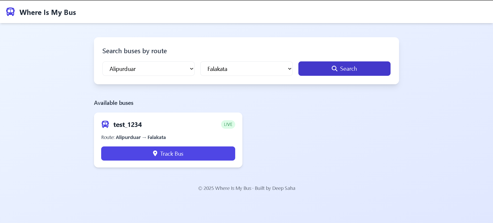
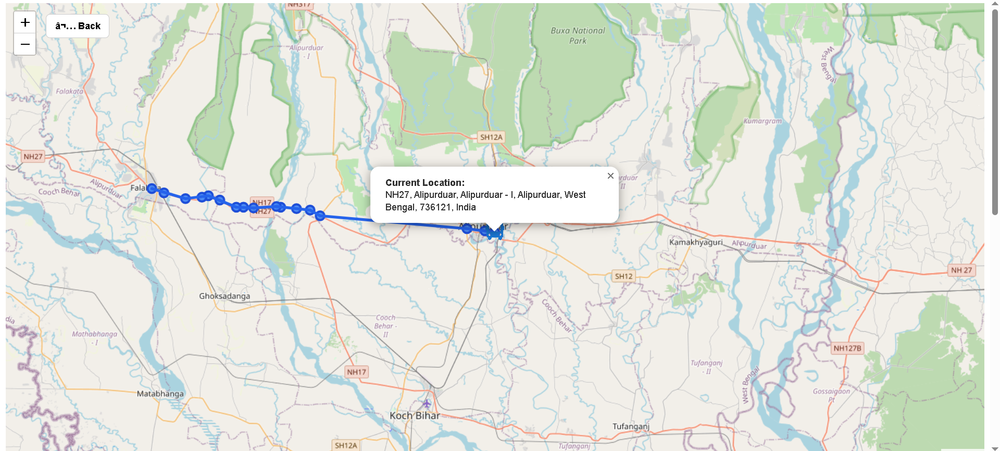
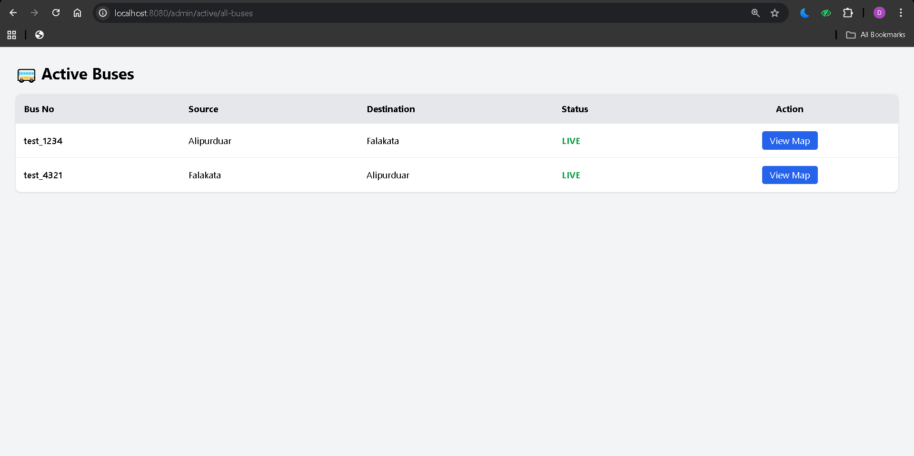

# 🚌 Where Is My Bus (WIMB)

## 📌 Project Description

**Where Is My Bus (WIMB)** is a real-time, route-based bus tracking system designed to solve the problem of **uncertain bus timings and locations**, especially in semi-urban and rural regions like North Bengal.

Unlike traditional systems that rely only on databases, WIMB uses a **hybrid approach**:
- **Dynamic data** (live bus location, rides)
- **Static route data** (stops, distance, halt times) loaded from **Excel files**
- **Frontend dropdown data** synchronized via **JSON**

This design makes the system **realistic, scalable, and easy to maintain** for government or private transport systems.

---

## ❓ Problem Statement

- Passengers wait without knowing the exact bus position
- No clarity on whether a bus has already crossed a stop
- Static routes are hardcoded or poorly managed
- No forward / reverse route intelligence

---

## ✅ Solution Overview

WIMB provides:

- 🔴 **Live bus tracking**
- 🗺️ **Excel-driven route visualization**
- 🔁 **Automatic forward & reverse direction handling**
- 🔎 **Source → Destination based bus search**
- 📍 ** Auto Completion dropdown-based stop selection (real-world UX)**
- ❌ **No false bus visibility after crossing source**

---

## 🛠️ Technology Stack

### 🔹 Backend
- Java 17
- Spring Boot
- REST APIs
- Apache POI (Excel processing)
- MySQL
- Jackson (JSON sync)

### 🔹 Frontend
- HTML
- Tailwind CSS
- JavaScript
- Leaflet.js
- OpenStreetMap
- Font Awesome

---

## 📸 Application Screenshots

### 🏠 Dashboard


### 🗺 Live Bus Tracking


### 🛣 Route Management


### 🔐 Admin Panel


## 🧱 Architecture


```
Driver App (GPS)
      ↓
Location API (Spring Boot)
      ↓
Database (Live Data)
      ↓
User UI (Leaflet Map)

Excel Route File
      ↓
Route Loader Service
      ↓
In-Memory Route Cache
      ↓
Route API
      ↓
Map + ETA Table
```

---

## 📂 Route Data Management

### 📘 Excel (Single Source of Truth)

Location:
routes/ABC.xlsx

```

### 📑 Excel Format (Mandatory)

| routeKey | stopName | latitude | longitude | distanceFromStartKm | slackTimeMin |
|----------|----------|----------|-----------|---------------------|--------------|
| SLG_NJP  | Siliguri | 26.7271  | 88.3953   | 0                   | 0            |
| SLG_NJP  | Bagdogra | 26.6986  | 88.3110   | 12                  | 5            |
| SLG_NJP  | NJP      | 26.6812  | 88.3290   | 18                  | 0            |

```
✔ Loaded once at application startup  
✔ No DB required for route data  
✔ Easy to update by non-technical staff

Defines:
- stopOrder
- stopName
- latitude / longitude
- distanceFromStartKm
- slackTimeMin

Loaded once at application startup.

---

### 📗 JSON (Frontend Dropdown)

Location:
data/stops.json

- Automatically updated from **Excel stopName column**
- Used only for UI dropdowns
- Prevents typing errors
- Enables direction detection

---

## 🔄 Direction Logic (Core Innovation)

Direction is determined automatically:

- **FORWARD** → sourceOrder < destinationOrder
- **BACKWARD** → sourceOrder > destinationOrder

### Passenger Visibility Rule

A bus is shown **only if it has NOT crossed the passenger's source stop**.

✔ Forward-safe  
✔ Reverse-safe  
✔ Real-world accurate

---

## 🔗 Backend API Endpoints

### ▶ Start Ride
```
POST /api/ride/start
```

```json
{
  "busId": 1,
  "source": "SLG",
  "destination": "NJP",
  "latitude": 26.7271,
  "longitude": 88.3953
}
```

---

### ▶ Update Location (Driver GPS)
```
POST /api/location/update
```

```json
{
  "rideId": 5,
  "latitude": 26.7210,
  "longitude": 88.3821,
  "speed": 32.5
}
```

---

### ▶ Get Active Buses on Route
```
GET /api/ride/active?source=SLG&destination=NJP
```

---

### ▶ Get Route Stops (Excel-backed)
```
GET /api/routes/{routeKey}
```

Example:
```
/api/routes/SLG_NJP
```

---


### ▶ Admin Dashboard (Track all bus location live)
```
GET /admin/active/all-buses
```


## 🖥️ Frontend Flow

### index.html
- Enter **Source & Destination**
- View **all active buses**
- Click **Track Bus**

### track.html
- Full route drawn from Excel
- Stops marked on map
- Live bus icon moves automatically
- Popup always shows current location
- ETA table rendered from route data

### admin-buses.html
- Enter **See all live buses**
- View **bus live location on map**
- Click **Track Bus**

---

## ✨ Key Highlights

- ETA prediction
- Excel = master data
- JSON auto-synced
- Direction-aware filtering
- No false bus visibility
- Designed for real transport systems

---

## 🚀 Future Enhancements

- WebSocket live tracking
- Admin Excel upload panel
- Alerts & notifications
- Multi-route support

---

## 👨‍💻 Author

**Deep Saha**  
Backend & System Design Enthusiast  
Java | Spring Boot | Maps | Real-Time Systems