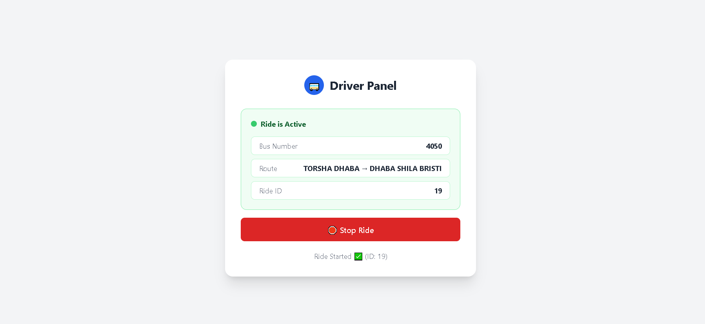

<div align="center">


<h1>Where Is My Bus</h1>
<h3>Real-time bus tracking for North Bengal</h3>


[](https://www.java.com)
[](https://spring.io/projects/spring-boot)
[](https://www.mysql.com)
[](https://redis.io)
[](https://tailwindcss.com)
[](LICENSE)

*Solving the problem of uncertain bus timings in semi-urban and rural regions*

[Features](#-features) · [Tech Stack](#-tech-stack) · [Screenshots](#-screenshots) · [Setup](#-setup--run) · [API Docs](#-api-endpoints) · [Author](#-author)

</div>

---

## 📖 About

**Where Is My Bus (WIMB)** is a real-time, route-based bus tracking system built for North Bengal. Unlike traditional systems, WIMB uses a **hybrid approach** combining live GPS data with Excel-driven static route files — making it practical, offline-friendly, and maintainable by non-technical staff.

> No app install needed. Works in any browser. Designed for low-connectivity areas.

---

## ✨ Features

<table>
<tr>
<td width="50%">

### 🧑‍💼 For Passengers
- 🔍 Search buses by source & destination
- 🕐 Recent searches with quick results
- 📍 Live route timeline (like "Where is my Train")
- 🚌 Animated bus icon on current stop
- ⏱️ ETA per stop from bus position
- 🌙 Dark mode support

</td>
<td width="50%">

### 🚗 For Drivers
- 🏢 Pick your depot + enter your depot's code (no personal login needed)
- 🔐 Code verified once per shift, then remembered on that device
- ↩️ Resume active ride after refresh
- 🗺️ GPS coordinates from Excel (no GPS needed at start)
- 📡 Live location sent every GPS tick, protected by a per-bus driver token

</td>
</tr>
<tr>
<td width="50%">

### 🛡️ For Admins
- 🔐 Secure login (Spring Security)
- 📊 Live card grid of all active buses
- 🔎 Search by bus number, source or destination
- 🕐 Recent searches saved
- 🔄 Auto-refresh every 5 seconds
- 🏢 **Depot Codes tab** — upload an Excel file to add/update every depot's driver code, no restart needed
- 📄 Built-in "download example template" so the file format is never a guessing game

</td>
<td width="50%">

### ⚙️ System Highlights
- 📊 Excel = single source of truth for routes **and** depot codes
- 🔁 Auto forward & reverse direction detection
- ❌ No false bus visibility after source stop
- 🗂️ JSON auto-synced from Excel on startup
- 🔐 Admin auth via config file, no DB needed
- 🔑 Driver actions protected by a short-lived, per-bus token — not just an open endpoint
- ⚡ Redis buffer for high-frequency GPS writes
- 🔄 Auto batch flush Redis → MySQL every 60s

</td>
</tr>
</table>

---

## 🛠️ Tech Stack

### Backend
| Technology | Version | Purpose |
|---|---|---|
| Java | 17 | Core language |
| Spring Boot | 3.x | REST API framework |
| Spring Security | 6.x | Admin authentication |
| Apache POI | 5.x | Excel processing (routes **and** depot codes, via `WorkbookFactory` — accepts `.xlsx`, `.xls`, `.xlsm`) |
| MySQL | 8.0 | Persistent ride & location storage |
| Redis | 7.x | High-frequency GPS location buffer + driver token store |
| Jackson | 2.x | JSON sync for stop dropdowns |

### Frontend
| Technology | Purpose |
|---|---|
| HTML5 | Page structure |
| Tailwind CSS | Layout utilities & dark mode |
| Google Fonts (Oswald, Inter, JetBrains Mono) | Brand type system — Oswald for headers/labels, Inter for body text, JetBrains Mono for IDs/codes/data |
| Vanilla JavaScript | All interactivity |
| Font Awesome | Icons (admin map view) |
| Leaflet.js | Live map view of all active buses |

---

## 📸 Screenshots

<table>
<tr>
<td align="center" width="50%">

<b>🏠 Passenger Search</b>
</td>
<td align="center" width="50%">

<b>🗺️ Live Route Timeline</b>
</td>
</tr>
<tr>
<td align="center" width="50%">

<b>🚗 Driver Panel</b>
</td>
<td align="center" width="50%">

<b>🛡️ Admin Panel</b>
</td>
</tr>
</table>

---

## 🧱 Architecture
```
┌─────────────────────────────────────────────────────────┐
│                      DRIVER APP                         │
│    Depot + code verified once  →  X-Driver-Token issued │
│         GPS coordinates sent every tick, with token      │
└────────────────────────┬────────────────────────────────┘
                         │ POST /api/driver/verify (once)
                         │ POST /api/ride/start   (X-Driver-Token)
                         │ POST /api/ride/location (X-Driver-Token)
                         ▼
┌─────────────────────────────────────────────────────────┐
│              SPRING BOOT BACKEND                        │
│                                                         │
│   DriverAuthController ─► DriverAccessService (depot codes)│
│                        └─► DriverTokenService (Redis)    │
│   RideController  ──►  RideService                       │
│   LocationController ─► LocationService                 │
│   RouteController ──►  RouteExcelLoader ─► Cache         │
│   AdminDepotController ─► DriverAccessService.reload()   │
│                              │                          │
│                              ▼                          │
│                     RedisLocationService                 │
│                        │         │                      │
│               Write fast│         │Read latest          │
│                        ▼         ▼                      │
│                    ┌────────────────┐                   │
│                    │     REDIS      │  ← GPS buffer     │
│                    │ location:ride: │  ← driver:token:  │
│                    └───────┬────────┘                   │
│                            │ Flush every 60s            │
│                            │ or on ride end             │
│                            ▼                            │
│                    ┌────────────────┐                   │
│                    │     MYSQL      │  ← Persistent     │
│                    └────────────────┘                   │
└────────────┬────────────────────────────────────────────┘
             │
             │ GET last-loc / active rides
             ▼
┌────────────────────┐   ┌───────────────────────────────┐
│   PASSENGER UI     │   │        EXCEL FILES            │
│                    │   │                               │
│  Route Timeline    │   │  Routes: stop_name, lat, lng,  │
│  ETA per stop      │   │  distance_km, slack_min        │
│  Live bus icon     │   │  Depot codes: depot_name, code │
└────────────────────┘   └───────────────────────────────┘

                    ADMIN ACCESS
                         │
                         ▼
              Spring Security Filter
                         │
              InMemoryUserDetailsManager
              (credentials from .properties)
                         │
                         ▼
          /admin-buses.html (Active Buses / Depot Codes tabs)
```

---

## ⚡ Redis Integration

WIMB uses Redis for two things: a **high-speed write buffer** for GPS location updates, and a lightweight **driver token store**.

### Why Redis for GPS?
GPS updates arrive every few seconds per active ride. Writing each update directly to MySQL causes high I/O and slow response times. Redis solves this by acting as an in-memory buffer.

### How it works

```
GPS Update (every ~3s)
        ↓
   Redis List (instant ~0.1ms write)
   key: location:ride:{rideId}
        ↓
   Scheduler (every 60s)  ──OR──  Ride ends (immediate flush)
        ↓
      MySQL (batch saveAll)
```

### Performance Comparison

| Aspect | Without Redis | With Redis |
|---|---|---|
| Write speed | ~5–10ms (MySQL) | ~0.1ms (Redis) |
| DB load | Every 3s hit | Batched every 60s |
| Live tracking | Query DB each time | Read from Redis cache |
| Data safety | Always persisted | Flushed on ride end |

### Redis Key Structure
```
location:ride:1     →  List of JSON location objects
location:ride:2     →  List of JSON location objects
driver:token:<uuid> →  Bus number this token was issued for (TTL ~12h, one shift)
```

### Flush Strategy
- **Scheduled flush** — `LocationFlushScheduler` runs every 60 seconds, drains all Redis keys to MySQL
- **Ride end flush** — When a ride is cancelled or a new ride starts for the same bus, remaining Redis data is immediately flushed so no location data is ever lost
- **Token expiry** — driver tokens expire on their own after ~12 hours; no cleanup job needed

---

## 🔑 Driver Verification (Depot Codes)

Drivers don't get individual accounts. Instead, each **depot** (e.g. Alipurduar, Siliguri, Cooch Behar) has one shared code, managed entirely by the admin through an Excel upload — no code changes, no restart.

### How it works
```
Driver opens driver.html
        │
        ▼
Picks their depot + enters that depot's code  ──►  POST /api/driver/verify
        │                                                  │
        │                                     DriverAccessService checks
        │                                     depot_name + code against
        │                                     the uploaded Excel file
        │                                                  │
        │                                                  ▼
        │                                     DriverTokenService issues a
        │                                     token (stored in Redis,
        │                                     ~12h TTL, tied to the bus
        │                                     number entered)
        ▼
Token saved in the browser (localStorage) — remembered for the rest of
the shift, so the code only needs to be entered once per device.
        │
        ▼
Every ride action (start / location / cancel) sends the token in the
X-Driver-Token header. The server checks the token resolves to the
same bus number the request claims to control.
```

### Depot codes Excel format

| depot_name | code |
|---|---|
| ALIPURDUAR | 101 |
| SILIGURI | 201 |
| COOCHBEHAR | 301 |

- Uploaded from the admin panel's **Depot Codes** tab
- Accepts `.xlsx`, `.xls`, or `.xlsm` — Apache POI's `WorkbookFactory` reads the actual file signature, not just the extension
- Each upload **replaces** the entire depot list (not merged)
- Stored on disk outside the build, at the path set by `wimb.depot.file.path` — so it survives restarts but doesn't need a rebuild to change
- The admin panel can also download a ready-made example file to fill in and re-upload

> 💡 This protects the write endpoints themselves (`/api/ride/start`, `/api/ride/location`, `/api/ride/cancel/**`), not just the driver page — even if someone finds the URL directly, they can't start or move a ride without a valid token.

---

## 📂 Route Data Management

Routes are managed entirely through **Excel files** — no code changes needed.
```
src/main/resources/routes/route_APD_FLK.xlsx
```

### Route Excel Format

| stop_order | stop_name | latitude | longitude | distance_km | slack_min |
|:---:|---|:---:|:---:|:---:|:---:|
| 1 | Alipurduar | 26.4799 | 89.5355 | 0 | 0 |
| 2 | Alipurduar Chowpathy | 26.48083 | 89.526 | 1.5 | 2 |
| 3 | Sonapur | 26.494 | 89.368 | 10.5 | 2 |
| 4 | Falakata | 26.51721 | 89.20694 | 15 | 0 |

> ✅ Loaded once at startup · ✅ No DB needed · ✅ Auto-syncs `stops.json`

For the depot codes Excel format (uploaded at runtime, not build-time), see [Driver Verification](#-driver-verification-depot-codes) above.

---

## 🔐 Admin Security

Admin panel is protected by **Spring Security** using `InMemoryUserDetailsManager`.  
**No database required** — credentials live in `application.properties`.
```properties
wimb.admin.username=admin
wimb.admin.password=wimb@2025
```

> 💡 To change credentials, update `application.properties` and restart. No code changes needed.

### Access Control

| URL | Who can access |
|---|:---:|
| `/index.html` `/track.html` `/driver.html` | 🌐 Everyone |
| `/api/ride/active` `/api/location/**` `/api/routes/**` | 🌐 Everyone |
| `/api/driver/**` (verify, depots list) | 🌐 Everyone |
| `/api/ride/start` `/api/ride/location` `/api/ride/cancel/**` | 🌐 Public route, 🔑 but requires a valid `X-Driver-Token` header — enforced in the controller, not by Spring Security |
| `/login.html` | 🌐 Everyone |
| `/admin-buses.html` | 🔐 Admin only |
| `/api/ride/active/all` | 🔐 Admin only *(also read by the driver's own "resume ride" check)* |
| `/admin/depots`, `/admin/depots/upload`, `/admin/depots/template` | 🔐 Admin only |

---

## 🔄 Direction Logic
```
sourceOrder < destinationOrder  →  FORWARD  ▶
sourceOrder > destinationOrder  →  BACKWARD ◀
```

A bus is shown to a passenger **only if it has NOT yet crossed their source stop** — computed by comparing the bus's position on the **full route**, not just the searched segment.

---

## 🔗 API Endpoints

<details>
<summary><b>🔑 Driver Verification APIs</b></summary>

#### Get Depot Names (for the dropdown)
```http
GET /api/driver/depots
```
Returns depot names only — never the codes.

#### Verify Depot + Code
```http
POST /api/driver/verify
Content-Type: application/json

{
  "depotName": "ALIPURDUAR",
  "code": "101",
  "busNumber": "WB-23A-1245"
}
```
Returns a token on success, tied to the given bus number for ~12 hours:
```json
{ "token": "a1b2c3d4-..." }
```

</details>

<details>
<summary><b>🚌 Ride APIs</b></summary>

#### Start Ride
```http
POST /api/ride/start
Content-Type: application/json
X-Driver-Token: a1b2c3d4-...

{
  "busNumber": "WB-23A-1245",
  "routeKey": "ALIPURDUAR_FALAKATA",
  "latitude": 26.4799,
  "longitude": 89.5355
}
```

#### Update Location
```http
POST /api/ride/location
Content-Type: application/json
X-Driver-Token: a1b2c3d4-...

{
  "rideId": 5,
  "latitude": 26.494,
  "longitude": 89.368,
  "accuracy": 12.5
}
```

#### Get Active Buses on Route
```http
GET /api/ride/active?source=ALIPURDUAR&destination=FALAKATA
```

#### Get All Active Buses *(Admin — also used by the driver's resume check)*
```http
GET /api/ride/active/all
```

#### Cancel Ride
```http
PUT /api/ride/cancel/{rideId}
X-Driver-Token: a1b2c3d4-...
```

</details>

<details>
<summary><b>📍 Location APIs</b></summary>

#### Get Last Known Location
```http
GET /api/location/last-loc/{rideId}
```
> ⚡ Returns from Redis if ride is active, falls back to MySQL if not buffered.

</details>

<details>
<summary><b>🗺️ Route APIs</b></summary>

#### Get Route Stops
```http
GET /api/routes?source=ALIPURDUAR&destination=FALAKATA
```

</details>

<details>
<summary><b>🏢 Admin Depot APIs</b></summary>

#### View Current Depot Codes
```http
GET /admin/depots
```

#### Upload New Depot Codes File
```http
POST /admin/depots/upload
Content-Type: multipart/form-data

file: depot-codes.xlsx
```
Replaces the entire depot list and reloads it immediately — no restart.

#### Download Example Template
```http
GET /admin/depots/template
```
Returns a ready-to-edit `.xlsx` with the correct headers and sample rows.

</details>

---

## 🖥️ Frontend Pages

| Page | Who uses it | Description |
|---|---|---|
| `index.html` | Passenger | Search buses, recent searches, quick results |
| `track.html` | Passenger | Live route timeline, ETA, bus position, dark mode |
| `driver.html` | Driver | Depot + code verification, start/resume ride, live GPS updates |
| `login.html` | Admin | Secure login form |
| `admin-buses.html` | Admin | Tabbed panel — **Active Buses** (live cards, search) and **Depot Codes** (upload, template download, current list) |

---

## 🗂️ Project Structure
```
WIMB/
├── src/main/java/com/deep/WIMB/
│   ├── config/
│   │   ├── SecurityConfig.java          # Spring Security rules
│   │   └── RedisConfig.java             # Redis template config
│   ├── controller/
│   │   ├── RideController.java
│   │   ├── LocationController.java
│   │   ├── RouteController.java
│   │   ├── DriverAuthController.java    # /api/driver/verify, /api/driver/depots
│   │   ├── AdminDepotController.java    # /admin/depots (view/upload/template)
│   │   └── CsrfController.java
│   ├── service/
│   │   ├── RideService.java
│   │   ├── LocationService.java
│   │   ├── RedisLocationService.java    # Redis read/write/clear
│   │   ├── RouteExcelLoader.java        # Loads route Excel on startup
│   │   ├── DriverAccessService.java     # Loads/reloads depot codes Excel
│   │   └── DriverTokenService.java      # Issues/resolves driver tokens (Redis)
│   ├── exception/
│   │   ├── DriverNotVerifiedException.java
│   │   └── ApiExceptionHandler.java     # Turns errors into JSON, not HTML pages
│   ├── scheduler/
│   │   └── LocationFlushScheduler.java  # Batch flush Redis → MySQL
│   ├── model/
│   │   ├── Ride.java
│   │   └── Location.java               # implements Serializable
│   └── dto/
│       ├── StartRideRequest.java
│       ├── LocationUpdateRequest.java
│       ├── ActiveRideResponse.java
│       └── RouteStop.java
│
├── src/main/resources/
│   ├── static/
│   │   ├── index.html                   # Passenger search
│   │   ├── track.html                   # Route timeline
│   │   ├── driver.html                  # Driver panel
│   │   ├── login.html                   # Admin login
│   │   ├── admin-buses.html             # Admin panel (tabbed)
│   │   ├── js/
│   │   │   ├── index.js
│   │   │   ├── track.js
│   │   │   ├── driver.js
│   │   │   └── admin-buses.js
│   │   └── data/
│   │       └── stops.json               # Auto-generated from Excel
│   ├── routes/
│   │   └── route_APD_FLK.xlsx           # Route master data (build-time)
│   └── application.properties
│
├── data/
│   └── depot-codes.xlsx                 # Depot codes (runtime, admin-uploaded — not in the build)
│
└── pom.xml
```

---

## ⚙️ Setup & Run

### Prerequisites

- Java 17+
- MySQL 8+
- Maven 3.8+
- Redis 7+

### Steps
```bash
# 1. Clone the repository
git clone https://github.com/Deep-Saha1925/Where-is-my-Bus.git
cd Where-is-my-Bus
```
```bash
# 2. Install and start Redis (Ubuntu)
sudo apt install redis-server -y
sudo systemctl start redis
sudo systemctl enable redis

# Verify Redis is running
redis-cli ping   # should return PONG
```
```bash
# 3. Create MySQL database
mysql -u root -p
```
```sql
CREATE DATABASE wimb;
EXIT;
```
```bash
# 4. Configure application.properties
```
```properties
# Database
spring.datasource.url=jdbc:mysql://localhost:3306/wimb
spring.datasource.username=root
spring.datasource.password=yourpassword
spring.jpa.hibernate.ddl-auto=update

# Redis
spring.data.redis.host=localhost
spring.data.redis.port=6379
spring.data.redis.timeout=2000ms

# Admin credentials
wimb.admin.username=admin
wimb.admin.password=wimb@2025

# Depot codes file (created/updated via the admin panel — no need to
# create it manually; the app just waits for the first upload)
wimb.depot.file.path=data/depot-codes.xlsx
```
```bash
# 5. Build and run
./mvnw spring-boot:run
```
```bash
# 6. Open in browser
open http://localhost:8080             # Passenger view
open http://localhost:8080/driver.html # Driver panel
open http://localhost:8080/login.html  # Admin login
```
```bash
# 7. First-time setup: upload depot codes
# Log in as admin → Depot Codes tab → download the example template,
# fill in your real depots, and upload. Drivers can verify immediately
# after — no restart required.
```

### Verify Redis is working
```bash
# After starting a ride, check Redis
redis-cli
KEYS *                          # should show location:ride:1 and driver:token:* entries
LLEN location:ride:1            # number of buffered locations
LRANGE location:ride:1 0 -1     # all buffered location JSON
TTL driver:token:<uuid>         # seconds remaining before that driver's token expires
```

---

## 🚀 Future Enhancements

- [ ] WebSocket live tracking (replace 3s polling)
- [x] ~~Admin Excel upload panel (no restart needed)~~ — done, for both routes and depot codes
- [ ] Push notifications when bus is nearby
- [ ] Multi-route support per Excel file
- [ ] Per-bus (not just per-depot) driver codes, for finer-grained access control
- [ ] Passenger seat booking
- [ ] Analytics dashboard for operators
- [ ] Mobile app (Android)

---

## 👨‍💻 Author

<div align="center">

**Deep Saha**

*Backend & System Design Enthusiast*

Java · Spring Boot · Real-Time Systems · North Bengal

[](https://github.com/Deep-Saha1925)

---

*Built with ❤️ for North Bengal*

</div>