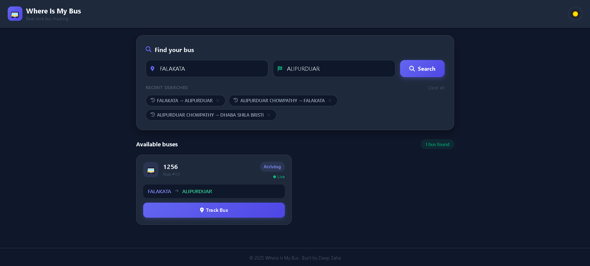
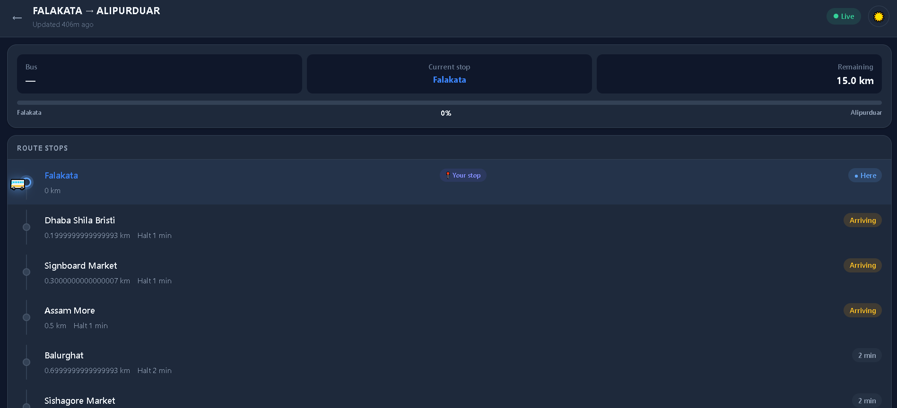
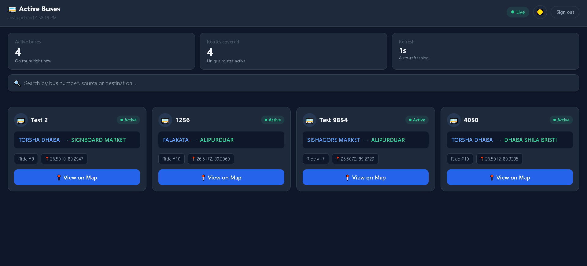

<div align="center">

# 🚌 Where Is My Bus
### Real-time bus tracking for North Bengal

[](https://www.java.com)
[](https://spring.io/projects/spring-boot)
[](https://www.mysql.com)
[](https://tailwindcss.com)
[](LICENSE)

*Solving the problem of uncertain bus timings in semi-urban and rural regions*

[Features](#-features) · [Tech Stack](#-tech-stack) · [Screenshots](#-screenshots) · [Setup](#-setup--run) · [API Docs](#-api-endpoints) · [Author](#-author)

</div>

---

## 📖 About

**Where Is My Bus (WIMB)** is a real-time, route-based bus tracking system built for North Bengal. Unlike traditional systems, WIMB uses a **hybrid approach** combining live GPS data with Excel-driven static route files — making it practical, offline-friendly, and maintainable by non-technical staff.

> No app install needed. Works in any browser. Designed for low-connectivity areas.

---

## ✨ Features

<table>
<tr>
<td width="50%">

### 🧑‍💼 For Passengers
- 🔍 Search buses by source & destination
- 🕐 Recent searches with quick results
- 📍 Live route timeline (like "Where is my Train")
- 🚌 Animated bus icon on current stop
- ⏱️ ETA per stop from bus position
- 🌙 Dark mode support

</td>
<td width="50%">

### 🚗 For Drivers
- 🔑 Login with bus number
- ↩️ Resume active ride after refresh
- 🗺️ GPS coordinates from Excel (no GPS needed at start)
- 📡 Live location sent every GPS tick

</td>
</tr>
<tr>
<td width="50%">

### 🛡️ For Admins
- 🔐 Secure login (Spring Security)
- 📊 Live card grid of all active buses
- 🔎 Search by bus number, source or destination
- 🕐 Recent searches saved
- 🔄 Auto-refresh every 5 seconds

</td>
<td width="50%">

### ⚙️ System Highlights
- 📊 Excel = single source of truth for routes
- 🔁 Auto forward & reverse direction detection
- ❌ No false bus visibility after source stop
- 🗂️ JSON auto-synced from Excel on startup
- 🔐 Admin auth via config file, no DB needed

</td>
</tr>
</table>

---

## 🛠️ Tech Stack

### Backend
| Technology | Version | Purpose |
|---|---|---|
| Java | 17 | Core language |
| Spring Boot | 3.x | REST API framework |
| Spring Security | 6.x | Admin authentication |
| Apache POI | 5.x | Excel route file processing |
| MySQL | 8.0 | Live ride & location storage |
| Jackson | 2.x | JSON sync for stop dropdowns |

### Frontend
| Technology | Purpose |
|---|---|
| HTML5 | Page structure |
| Tailwind CSS | Styling & dark mode |
| Vanilla JavaScript | All interactivity |
| Font Awesome | Icons |

---

## 📸 Screenshots

<table>
<tr>
<td align="center" width="50%">

<b>🏠 Passenger Search</b>
</td>
<td align="center" width="50%">

<b>🗺️ Live Route Timeline</b>
</td>
</tr>
<tr>
<td align="center" width="50%">

<b>🚗 Driver Panel</b>
</td>
<td align="center" width="50%">

<b>🛡️ Admin Panel</b>
</td>
</tr>
</table>

---

## 🧱 Architecture
```
┌─────────────────────────────────────────────────────────┐
│                      DRIVER APP                         │
│              GPS coordinates every tick                 │
└────────────────────────┬────────────────────────────────┘
                         │ POST /api/ride/start
                         │ POST /api/ride/location
                         ▼
┌─────────────────────────────────────────────────────────┐
│              SPRING BOOT BACKEND                        │
│                                                         │
│   RideController  ──►  RideService  ──►  MySQL          │
│   LocationController ─► LocationService ─► MySQL        │
│   RouteController ──►  RouteExcelLoader ─► Cache        │
└────────────┬───────────────────────┬────────────────────┘
             │                       │
             │ GET last-loc          │ GET routes
             ▼                       ▼
┌────────────────────┐   ┌───────────────────────────────┐
│   PASSENGER UI     │   │        EXCEL FILE             │
│                    │   │                               │
│  Route Timeline    │   │  stop_name, lat, lng,         │
│  ETA per stop      │   │  distance_km, slack_min       │
│  Live bus icon     │   │                               │
└────────────────────┘   └───────────────────────────────┘

                    ADMIN ACCESS
                         │
                         ▼
              Spring Security Filter
                         │
              InMemoryUserDetailsManager
              (credentials from .properties)
                         │
                         ▼
                 /admin-buses.html
```

---

## 📂 Route Data Management

Routes are managed entirely through **Excel files** — no code changes needed.
```
src/main/resources/routes/route_APD_FLK.xlsx
```

### Excel Format

| stop_order | stop_name | latitude | longitude | distance_km | slack_min |
|:---:|---|:---:|:---:|:---:|:---:|
| 1 | Alipurduar | 26.4799 | 89.5355 | 0 | 0 |
| 2 | Alipurduar Chowpathy | 26.48083 | 89.526 | 1.5 | 2 |
| 3 | Sonapur | 26.494 | 89.368 | 10.5 | 2 |
| 4 | Falakata | 26.51721 | 89.20694 | 15 | 0 |

> ✅ Loaded once at startup · ✅ No DB needed · ✅ Auto-syncs `stops.json`

---

## 🔐 Admin Security

Admin panel is protected by **Spring Security** using `InMemoryUserDetailsManager`.  
**No database required** — credentials live in `application.properties`.
```properties
wimb.admin.username=admin
wimb.admin.password=wimb@2025
```

> 💡 To change credentials, update `application.properties` and restart. No code changes needed.

### Access Control

| URL | Who can access |
|---|:---:|
| `/index.html` `/track.html` `/driver.html` | 🌐 Everyone |
| `/api/ride/active` `/api/ride/start` `/api/location/**` `/api/routes/**` | 🌐 Everyone |
| `/login.html` | 🌐 Everyone |
| `/admin-buses.html` | 🔐 Admin only |
| `/api/ride/active/all` | 🔐 Admin only |

---

## 🔄 Direction Logic
```
sourceOrder < destinationOrder  →  FORWARD  ▶
sourceOrder > destinationOrder  →  BACKWARD ◀
```

A bus is shown to a passenger **only if it has NOT yet crossed their source stop** — computed by comparing the bus's position on the **full route**, not just the searched segment.

---

## 🔗 API Endpoints

<details>
<summary><b>🚌 Ride APIs</b></summary>

#### Start Ride
```http
POST /api/ride/start
Content-Type: application/json

{
  "busNumber": "WB-23A-1245",
  "routeKey": "ALIPURDUAR_FALAKATA",
  "latitude": 26.4799,
  "longitude": 89.5355
}
```

#### Update Location
```http
POST /api/ride/location
Content-Type: application/json

{
  "rideId": 5,
  "latitude": 26.494,
  "longitude": 89.368,
  "accuracy": 12.5
}
```

#### Get Active Buses on Route
```http
GET /api/ride/active?source=ALIPURDUAR&destination=FALAKATA
```

#### Get All Active Buses *(Admin)*
```http
GET /api/ride/active/all
```

#### Cancel Ride
```http
PUT /api/ride/cancel/{rideId}
```

</details>

<details>
<summary><b>📍 Location APIs</b></summary>

#### Get Last Known Location
```http
GET /api/location/last-loc/{rideId}
```

</details>

<details>
<summary><b>🗺️ Route APIs</b></summary>

#### Get Route Stops
```http
GET /api/routes?source=ALIPURDUAR&destination=FALAKATA
```

</details>

---

## 🖥️ Frontend Pages

| Page | Who uses it | Description |
|---|---|---|
| `index.html` | Passenger | Search buses, recent searches, quick results |
| `track.html` | Passenger | Live route timeline, ETA, bus position |
| `driver.html` | Driver | Start/resume ride, live GPS updates |
| `login.html` | Admin | Secure login form |
| `admin-buses.html` | Admin | All active buses, search, live stats |

---

## 🗂️ Project Structure
```
WIMB/
├── src/main/java/com/deep/WIMB/
│   ├── config/
│   │   └── SecurityConfig.java          # Spring Security rules
│   ├── controller/
│   │   ├── RideController.java
│   │   ├── LocationController.java
│   │   ├── RouteController.java
│   │   ├── DriverController.java
│   │   └── CsrfController.java
│   ├── service/
│   │   ├── RideService.java
│   │   ├── LocationService.java
│   │   └── RouteExcelLoader.java        # Loads Excel on startup
│   ├── model/
│   │   ├── Ride.java
│   │   └── Location.java
│   └── dto/
│       ├── StartRideRequest.java
│       ├── ActiveRideResponse.java
│       └── RouteStop.java
│
├── src/main/resources/
│   ├── static/
│   │   ├── index.html                   # Passenger search
│   │   ├── track.html                   # Route timeline
│   │   ├── driver.html                  # Driver panel
│   │   ├── login.html                   # Admin login
│   │   ├── admin-buses.html             # Admin panel
│   │   ├── js/
│   │   │   ├── index.js
│   │   │   ├── track.js
│   │   │   ├── driver.js
│   │   │   └── admin-buses.js
│   │   └── data/
│   │       └── stops.json               # Auto-generated from Excel
│   ├── routes/
│   │   └── route_APD_FLK.xlsx           # Route master data
│   └── application.properties
└── pom.xml
```

---

## ⚙️ Setup & Run

### Prerequisites

- Java 17+
- MySQL 8+
- Maven 3.8+

### Steps
```bash
# 1. Clone the repository
git clone https://github.com/Deep-Saha1925/Where-is-my-Bus.git
cd Where-is-my-Bus
```
```bash
# 2. Create MySQL database
mysql -u root -p
```
```sql
CREATE DATABASE wimb;
EXIT;
```
```bash
# 3. Configure application.properties
```
```properties
# Database
spring.datasource.url=jdbc:mysql://localhost:3306/wimb
spring.datasource.username=root
spring.datasource.password=yourpassword
spring.jpa.hibernate.ddl-auto=update

# Admin credentials
wimb.admin.username=admin
wimb.admin.password=wimb@2025
```
```bash
# 4. Build and run
./mvnw spring-boot:run
```
```bash
# 5. Open in browser
open http://localhost:8080           # Passenger view
open http://localhost:8080/login.html  # Admin login
```

---

## 🚀 Future Enhancements

- [ ] WebSocket live tracking (replace 3s polling)
- [ ] Admin Excel upload panel (no restart needed)
- [ ] Push notifications when bus is nearby
- [ ] Multi-route support per Excel file
- [ ] Driver authentication with OTP
- [ ] Passenger seat booking
- [ ] Analytics dashboard for operators
- [ ] Mobile app (Android)

---

## 👨‍💻 Author

<div align="center">

**Deep Saha**

*Backend & System Design Enthusiast*

Java · Spring Boot · Real-Time Systems · North Bengal

[](https://github.com/Deep-Saha1925)

---

*Built with ❤️ for North Bengal*

</div>