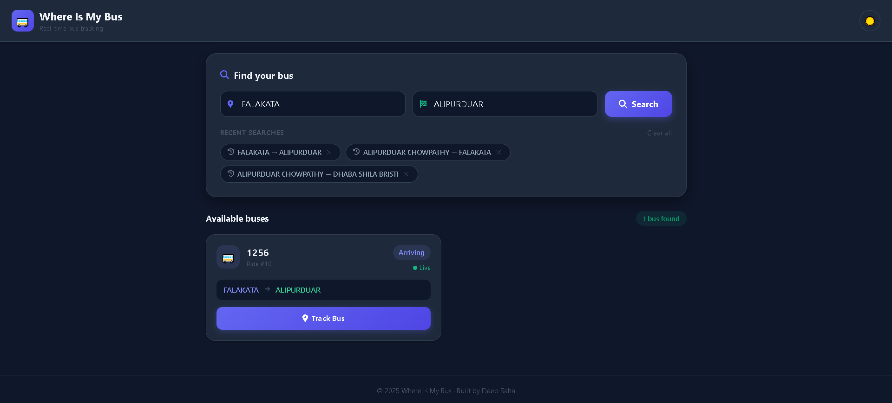
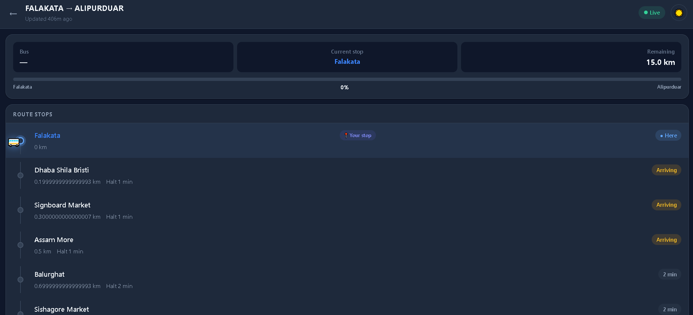
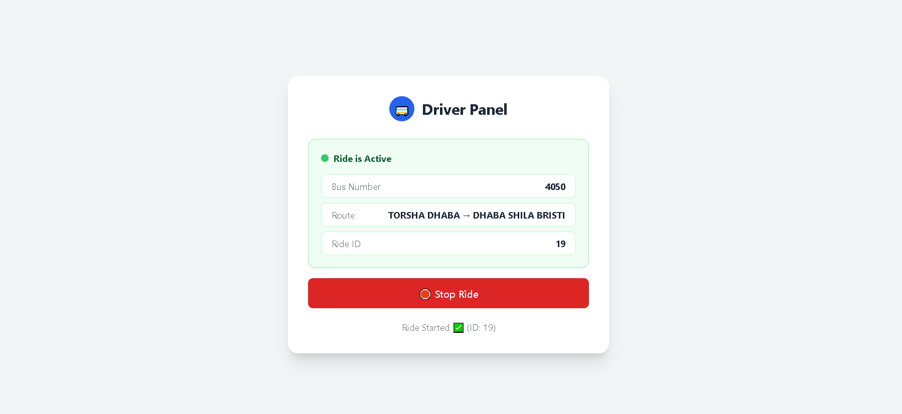
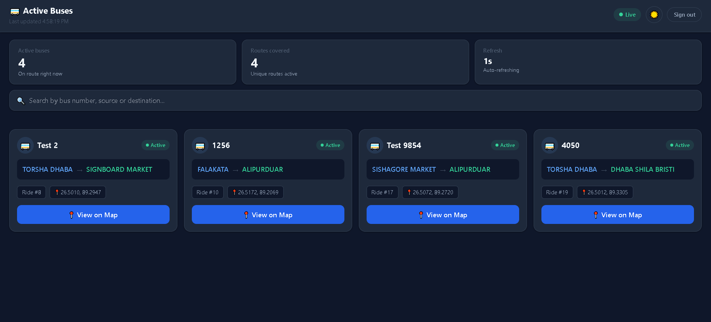

<div align="center">


<h1>Where Is My Bus</h1>
<h3>Real-time bus tracking for North Bengal</h3>


[](https://www.java.com)
[](https://spring.io/projects/spring-boot)
[](https://neon.tech)
[](https://upstash.com)
[](https://www.thymeleaf.org)
[](https://tailwindcss.com)
[](Dockerfile)
[](https://render.com)
[-red?style=flat-square)](LICENSE)

*Solving the problem of uncertain bus timings in semi-urban and rural regions*

**🔗 Live: [where-is-my-bus-8z4a.onrender.com](https://where-is-my-bus-8z4a.onrender.com)**
*(Free-tier hosting — the app sleeps after 15 minutes idle, so the first request after a gap may take 30–50s to wake up.)*

[Features](#-features) · [Tech Stack](#-tech-stack) · [Screenshots](#-screenshots) · [Live Updates](#-live-updates-websocket) · [Bus Number Search](#-search-by-bus-number) · [Testing Without a Bus](#-testing-without-a-bus-simulate-location) · [Login Rate Limiting](#-login-rate-limiting--cors) · [Ghost Rides](#-ghost-rides-auto-end) · [Automated Tests](#-automated-tests) · [Driver App](#-driver-app-background-gps) · [Location Clean-up](#-location-history-clean-up) · [Redis Outages](#-when-redis-is-down) · [Use My Location](#-use-my-location-passenger) · [Setup](#-setup--run) · [Deployment](#-deployment) · [API Docs](#-api-endpoints) · [License](#-license) · [Author](#-author)

</div>

---

## 📖 About

**Where Is My Bus (WIMB)** is a real-time, route-based bus tracking system built for North Bengal. Unlike traditional systems, WIMB uses a **hybrid approach** combining live GPS data with Excel-driven route and access-control files — making it practical, offline-friendly, and maintainable by non-technical staff, without needing anyone to touch code.

> No app install needed. Works in any browser. Designed for low-connectivity areas.

---

## ✨ Features

<table>
<tr>
<td width="50%">

### 🧑‍💼 For Passengers
- 🔍 Search buses by source & destination
- 📍 **Use my location**: a crosshair button in the From field fills in the nearest stop, and the tracking page can show how far the bus is from you, see [Use My Location](#-use-my-location-passenger)
- 🚌 **Search by bus number** — a third tab next to Live Buses and Depot Routes; type `wb23a1245` and find `WB-23A-1245` (case, spaces and dashes ignored, partial numbers work), see [Search by Bus Number](#-search-by-bus-number)
- ⌨️ Custom styled autocomplete dropdown for stop search — type-ahead matching with highlighted results, arrow-key navigation, and click-to-select (no plain browser popup)
- 🕐 Recent searches with quick results
- 📍 Live route timeline (like "Where is my Train") — opens with the bus scrolled to the middle of the screen, then you scroll freely
- 🚌 Animated bus icon on current stop
- ⏱️ ETA per stop from bus position
- 🌙 Dark mode support
- 🧭 One-tap header shortcuts to the Driver panel and Admin login — no manual URL typing needed

</td>
<td width="50%">

### 🚗 For Drivers
- 🏢 Log in with your **bus number + depot + depot code** (no personal account needed) — asked every time the page is opened
- ↩️ If that bus already has a running ride, an **"Active ride found"** screen offers *Resume This Ride* or *Start New Ride Instead*; resuming reopens the live ride screen with a **Stop Ride** button
- ⏳ A neutral **Loading…** screen shows while depots/routes load, so the page never flashes the wrong step
- 🛣️ Pick your Route first — Start Location / Destination are then scoped to just that route's stops, not a global list
- 🗺️ GPS coordinates from Excel (no GPS needed at start)
- 📍 **Current stop position** card on the ride screen — "At KOLKATA" / "Between A → B (40%)", stop *n* of *N*, progress bar, and a Live/Simulated badge
- 🧪 **Simulate location** tab for testing without driving — see [Testing Without a Bus](#-testing-without-a-bus-simulate-location)
- 📡 Live location sent on every GPS tick (never dropped — see below), protected by a per-bus driver token, pushed to passengers instantly over WebSocket

</td>
</tr>
<tr>
<td width="50%">

### 🛡️ For Admins
- 🔐 Secure login (Spring Security)
- 📊 Live card grid of all active buses
- 🔎 Search by bus number, source or destination
- 📡 Live updates pushed via WebSocket the instant a ride starts, ends, or moves — 30s fallback poll only if the socket ever drops
- 🏢 **Depot Codes tab** — upload an Excel file to add/update every depot's driver code, no restart needed
- 🛣️ **Routes tab** — add new routes via Excel upload, rename a route and/or replace its stops, or delete one entirely — all without a restart
- 📄 Built-in "download example template" for both depot codes and routes, so the file format is never a guessing game

</td>
<td width="50%">

### ⚙️ System Highlights
- 📊 Excel = single source of truth for routes **and** depot codes
- 🛣️ Multiple independent routes can coexist — each with its own stop list, own name, own code
- 🔁 Auto forward & reverse direction detection
- ❌ No false bus visibility after source stop
- 🗂️ JSON auto-synced from Excel on startup
- 🔐 Admin auth via config file, no DB needed
- 🔑 Driver actions protected by a short-lived, per-bus token — not just an open endpoint
- 👻 **Ghost buses are handled automatically**: a ride whose driver goes silent is hidden from passengers after 5 minutes and ended after 30, see [Ghost Rides](#-ghost-rides-auto-end)
- 🛡️ Driver login is **brute-force protected** (failed attempts counted per IP, per depot and per bus, then locked out with HTTP 429), see [Login Rate Limiting & CORS](#-login-rate-limiting--cors)
- ⚡ Redis buffer for high-frequency GPS writes
- 🧠 In-memory active-ride cache — driver token checks on the GPS hot path no longer hit Postgres at all (see [Active Ride Cache](#-active-ride-cache))
- 📡 WebSocket push for live tracking — replaces the old 3s/5s polling, see [Live Updates](#-live-updates-websocket)
- 🔎 Bus-number search runs as a **database query** (not "load every ride, filter in the browser") with a short server cache and a per-tab cache, see [Search by Bus Number](#-search-by-bus-number)
- 🔄 Auto batch flush Redis → PostgreSQL every 60s
- 🐳 Containerized with Docker, deployed on Render
- 🗺️ Route file paths normalized at load time — Excel files registered on one OS (e.g. Windows during local dev) still resolve correctly in production on Linux

</td>
</tr>
</table>

---

## 🛠️ Tech Stack

### Backend
| Technology | Version | Purpose |
|---|---|---|
| Java | 21 | Core language |
| Spring Boot | 4.x | REST API framework |
| Spring Security | 6.x | Admin authentication |
| Spring WebSocket (STOMP) | — | Live push for GPS locations & active-ride list — see [Live Updates](#-live-updates-websocket) |
| Thymeleaf | 3.x | Server-rendered views for `driver.html`, `admin.html`, `admin-buses.html` |
| Apache POI | 5.x | Excel processing (routes **and** depot codes, via `WorkbookFactory` — accepts `.xlsx`, `.xls`, `.xlsm`) |
| PostgreSQL (Neon, hosted) | 16+ | Persistent ride, location & route storage |
| Redis (Upstash, hosted) | — | High-frequency GPS location buffer + driver token store |
| Jackson | 2.x | JSON sync for stop dropdowns |
| Docker | — | Multi-stage build (Maven build → slim JRE runtime image) |

> ⚠️ Both the database and Redis connection strings are supplied via **environment variables** (`DB_URL`, `DB_USERNAME`, `DB_PASSWORD`, `REDIS_HOST`, `REDIS_PORT`, `REDIS_PASSWORD`) — never hardcoded in `application.properties`, and never committed to the repo. See [Deployment](#-deployment) for the full list.

### Frontend
| Technology | Purpose |
|---|---|
| HTML5 | Page structure |
| Tailwind CSS | Layout utilities & dark mode |
| Google Fonts (Oswald, Inter, JetBrains Mono) | Brand type system — Oswald for headers/labels, Inter for body text, JetBrains Mono for IDs/codes/data |
| Vanilla JavaScript | All interactivity, including a custom-built autocomplete dropdown (stop search) with keyboard navigation and match highlighting |
| SockJS + stomp.js | WebSocket client for live bus tracking (loaded via cdnjs), with a graceful fallback poll if the connection ever drops |
| Font Awesome | Icons (admin map view, header shortcuts, stop dropdown) |
| Leaflet.js | Live map view of all active buses |

---

## 📸 Screenshots

<table>
<tr>
<td align="center" width="50%">

<b>🏠 Passenger Search</b>
</td>
<td align="center" width="50%">

<b>🗺️ Live Route Timeline</b>
</td>
</tr>
<tr>
<td align="center" width="50%">

<b>🚗 Driver Panel</b>
</td>
<td align="center" width="50%">

<b>🛡️ Admin Panel</b>
</td>
</tr>
</table>

---

## 🧱 Architecture
```
┌─────────────────────────────────────────────────────────┐
│                      DRIVER APP                         │
│    Depot + code verified once  →  X-Driver-Token issued │
│         Route picked  →  source/destination scoped to it │
│         GPS coordinates sent every tick, with token      │
└────────────────────────┬────────────────────────────────┘
                         │ POST /api/driver/verify (once)
                         │ GET  /api/routes/list, /api/routes/stops
                         │ POST /api/ride/start   (X-Driver-Token)
                         │ POST /api/ride/location (X-Driver-Token)
                         ▼
┌─────────────────────────────────────────────────────────┐
│              SPRING BOOT BACKEND                        │
│                                                         │
│   DriverAuthController ─► DriverAccessService (depot codes)│
│                        └─► DriverTokenService (Redis)    │
│   RideController  ──►  RideService  ──►  ActiveRideCache  │
│        └─ GET /api/ride/search ─► RideRepository (DB query) │
│                                   └─► BusSearchCache (5s)   │
│   LocationController ─► LocationService ──► ActiveRideCache│
│                        (in-memory rideId→busNumber, so    │
│                        every GPS ping's auth check is 0   │
│                        Postgres queries — see below)      │
│   RouteController ──►  RouteExcelLoader ─► Cache           │
│   AdminDepotController ─► DriverAccessService.reload()   │
│   AdminRouteController ─► RouteRepository + RouteExcelLoader│
│                              │                          │
│                              ▼                          │
│                     RedisLocationService                 │
│                        │         │                      │
│               Write fast│         │Read latest          │
│                        ▼         ▼                      │
│                    ┌────────────────┐                   │
│                    │     REDIS      │  ← GPS buffer     │
│                    │ location:ride: │  ← driver:token:  │
│                    └───────┬────────┘                   │
│                            │ Flush every 60s            │
│                            │ or on ride end             │
│                            ▼                            │
│                    ┌────────────────┐                   │
│                    │   POSTGRESQL   │  ← Ride, Location, │
│                    │                │    Route, Bus      │
│                    └────────────────┘                   │
│                                                          │
│   LocationService / RideService ──► SimpMessagingTemplate │
│                                       │                  │
│                                       ▼                  │
│                        ┌─────────────────────────┐       │
│                        │   WEBSOCKET (STOMP)    │       │
│                        │  /topic/ride/{rideId}   │       │
│                        │  /topic/activeRides     │       │
│                        └─────────────────────────┘       │
└────────────┬───────────────────────┬────────────────────┘
             │                       │ live push (WS)
             │ GET last-loc / active rides (fallback poll)
             ▼                       ▼
┌────────────────────┐   ┌───────────────────────────────┐
│   PASSENGER UI     │   │        EXCEL FILES            │
│                    │   │                               │
│  Route Timeline    │   │  Routes: stop_name, lat, lng,  │
│  ETA per stop      │   │  distance_km, slack_min        │
│  Live bus icon     │   │  Depot codes: depot_name, code │
└────────────────────┘   └───────────────────────────────┘

                    ADMIN ACCESS
                         │
                         ▼
              Spring Security Filter
                         │
              InMemoryUserDetailsManager
              (credentials from environment variables)
                         │
                         ▼
     /admin-buses.html (Active Buses / Depot Codes / Routes tabs)
```

---

## ⚡ Redis Integration

WIMB uses Redis (hosted on Upstash) for two things: a **high-speed write buffer** for GPS location updates, and a lightweight **driver token store**.

### Why Redis for GPS?
GPS updates arrive every few seconds per active ride. Writing each update directly to the database causes high I/O and slow response times. Redis solves this by acting as an in-memory buffer.

### How it works

```
GPS Update (every ~3s)
        ↓
   Redis List (instant ~0.1ms write)
   key: location:ride:{rideId}
        ↓
   Scheduler (every 60s)  ──OR──  Ride ends (immediate flush)
        ↓
   PostgreSQL (batch saveAll)
```

### Performance Comparison

| Aspect | Without Redis | With Redis |
|---|---|---|
| Write speed | ~5–10ms (DB) | ~0.1ms (Redis) |
| DB load | Every 3s hit | Batched every 60s |
| Live tracking | Query DB each time | Read from Redis cache |
| Data safety | Always persisted | Flushed on ride end |

### Redis Key Structure
```
location:ride:1     →  List of JSON location objects
location:ride:2     →  List of JSON location objects
driver:token:<uuid> →  Bus number this token was issued for (TTL ~12h, one shift)
```

### Flush Strategy
- **Scheduled flush** — `LocationFlushScheduler` runs every 60 seconds, drains all Redis keys to the database
- **Ride end flush** — When a ride is cancelled or a new ride starts for the same bus, remaining Redis data is immediately flushed so no location data is ever lost
- **Token expiry** — driver tokens expire on their own after ~12 hours; no cleanup job needed

---

## 🧠 Active Ride Cache

Redis solves the GPS *write* problem — but until recently, every single location update still cost **two full Postgres queries** before that write ever happened: one to check the driver's token belongs to the ride's bus, one more (redundantly) inside the save logic itself. On a driver sending a GPS tick every few seconds, across even a handful of concurrently active buses, that's enough load to start queueing behind the connection pool — the exact bottleneck Redis was supposed to prevent, just one step earlier in the request.

`ActiveRideCache` closes that gap: a simple in-memory map of `rideId → busNumber` for every currently active ride, kept in sync when a ride starts, ends, or is cancelled, and rebuilt from the database on startup (so a restart doesn't strand an in-progress ride). Both `/api/location/update` and `/api/ride/location` now check this cache instead of querying Postgres — the driver-auth check on the hottest endpoint in the app now costs **zero** database queries.

```
GPS update arrives
        ↓
Check ActiveRideCache (in-memory, ~microseconds)
        ↓
Valid?  ──► write to Redis (see above) ──► push over WebSocket
Invalid? ──► reject, no DB touched either way
```

> ⚠️ **Single-instance limitation, by design (for now):** this cache lives in one JVM's memory, which is correct for the app's current single-Render-instance deployment but will *not* stay correct across multiple instances — a ride started on instance A wouldn't be visible to instance B's cache. When the app moves to a VPS running more than one instance, this needs to move to Redis (same pattern as `DriverTokenService` already uses), so every instance shares the same view of which rides are active. Noted directly in the code (`ActiveRideCache.java`) as well, so it isn't a surprise later.

---

## 📡 Live Updates (WebSocket)

Passenger and admin views used to **poll**: `track.html` hit `/api/location/last-loc/{rideId}` every 3 seconds per open tab, and `admin-buses.html` hit `/api/ride/active/all` every 5 seconds — load that scaled with how many people were *watching*, not with how many buses were actually moving. Ten passengers tracking the same bus meant ten requests every 3 seconds for data that usually hadn't changed at all.

That's now a **push**, over a STOMP-over-WebSocket connection (via SockJS, so it degrades gracefully on networks that block raw WebSocket):

```
Driver sends a GPS update
        ↓
LocationService.addLocation()
        ↓
   ┌────────────────────┬───────────────────────┐
   ▼                    ▼                       
Redis (buffer)   /topic/ride/{rideId}  ← track.js subscribes
                         
Ride starts / ends
        ↓
/topic/activeRides  ← admin-buses.js + track.js's auto-select both subscribe
```

| Topic | Who subscribes | Payload |
|---|---|---|
| `/topic/ride/{rideId}` | `track.html`, for the one bus a passenger is watching | `{ rideId, latitude, longitude, accuracy, timestamp }` — `timestamp` is an ISO-8601 instant ending in `Z` |
| `/topic/activeRides` | `admin-buses.html`'s bus grid; `track.html`'s auto-select-a-bus flow | The same list `/api/ride/active/all` returns |

- **Handshake endpoint:** `/ws` (public, same access level as the other passenger/driver-facing tracking endpoints)
- **Fallback polling kept as a safety net** — in case a socket silently dies (a flaky network, a proxy that kills idle connections):
  - `track.html` checks every **5s**, but *skips* the request while live pushes are arriving (anything newer than 15s). A healthy socket costs nothing extra; a broken one is noticed within seconds instead of the old 20s.
  - Switching back to the tab (phones put background tabs and their sockets to sleep) fetches the latest position immediately.
  - A dropped connection reconnects and re-subscribes automatically, keeping stomp.js's own disconnect handling intact.
  - `admin-buses.html` still falls back to a 30s poll.
- **Driver-side sends never drop the newest position.** `driver.js` posts at most once per 3s (once per 1s while simulating). A position arriving inside that window used to be discarded, so passengers only saw it at the next 10s heartbeat — or never, if the bus then stopped. It is now queued and sent as soon as the window ends, using whatever the *latest* position is by then.
- **Single-instance limitation:** the message broker (`registry.enableSimpleBroker`) is in-memory, same caveat as `ActiveRideCache` above — a message published on one instance won't reach a passenger connected to a different instance. Moving to multiple instances means swapping this for a real broker (e.g. Redis pub/sub relayed to STOMP, or RabbitMQ's STOMP plugin).

---

## 🚌 Search by Bus Number

Passengers can find a running bus directly by its number — the **Bus Number** tab on the home page (next to *Live Buses* and *Depot Routes*). Each result card shows the bus number, ride ID, source → destination and a Live badge, and **Track Bus** opens the normal tracking page for that ride. ETA is intentionally not shown on these cards: an ETA is measured to a passenger's boarding stop, and a bus-number search doesn't have one.

### How it works

```
Passenger types "wb23a"                 (400ms pause after the last key)
        ↓
Per-tab cache hit (15s)?  ── yes ──► show instantly, no request
        │ no
        ▼
GET /api/ride/search?busNumber=wb23a
        ↓
BusSearchCache hit (5s)?  ── yes ──► return cached list
        │ no
        ▼
RideRepository.searchByBusNumber(ACTIVE, "wb23a", top 20)   ← one SQL query, bus joined in
        ↓
exact matches first, then alphabetical → cached → returned
```

- **Matching** ignores case, spaces, dashes, underscores, `/` and `.` on both sides, so `wb23a1245`, `WB 23A 1245` and `wb-23a-1245` all find `WB-23A-1245`. Partial numbers match anywhere in the number.
- **The filtering happens in the database.** The old approach downloaded every active ride and filtered in the browser, which gets slower with every bus that starts running. The repository query only reads *active* rides whose bus number matches, joins the bus in the same query (no extra query per ride), and returns at most **20** rows.
- **Two small caches, both with short lifetimes:**
  - `BusSearchCache` (server) — 5s per query, max 500 entries, no extra dependency. It is **cleared whenever a ride starts or ends**, so a bus that just started or stopped never shows up stale.
  - A per-tab cache in `index.js` — 15s per query, so retyping the same number is instant.
- **Old results never linger.** Every new keystroke or search wipes the results area immediately, cancels the previous request (`AbortController`) and bumps a sequence number, so a slow earlier response can never draw over a newer search. Switching tabs cancels any pending bus search too.
- Public endpoint, same access level as `/api/ride/active`.

> ⚠️ `LIKE '%text%'` can't use a normal database index, so the speed-up comes from only reading active rides and capping the result count — which is small for this app. Single-instance caveat applies to `BusSearchCache` exactly as it does to `ActiveRideCache`.

---

## 🧪 Testing Without a Bus (Simulate Location)

Real GPS on a laptop rarely fires, and even when it does it reports your desk, not a point on the route. The driver's ride screen therefore has two tabs:

| Tab | What it does |
|---|---|
| **📡 Live GPS** | Normal behaviour — the browser's real GPS is sent as the bus location. |
| **🧪 Simulate location** | Pick a stop from the route, or slide toward the next stop. That position is sent exactly like a real GPS fix, and real GPS is **ignored** until you switch back. |

In the Simulate tab:
- **Stop picker** — "bus is at / just after stop *n*" (all stops of the ride's route).
- **Slider (0–100%)** — interpolates between that stop and the next one.
- **⏮ Prev stop / Next stop ⏭** — jump to the neighbouring stop and send immediately.
- **📍 Send this location now** — posts right away, bypassing the throttle.
- The 10-second heartbeat keeps re-sending the simulated point so the bus doesn't look offline; switching back to **Live GPS** drops the fake position.

The **Current stop position** card above the tabs reflects whichever mode is active: in Simulate it mirrors the picker/slider, in Live GPS it shows the nearest stop (within 150 m = "At …", otherwise "Near … · 1.2 km away").

**Quick test:** start a ride on the driver page → open the Simulate tab → open `track.html` for that ride (or search the bus number) in another window → press *Next stop* — the bus should move on the passenger page within a couple of seconds.

---

## 🔑 Driver Verification (Depot Codes)

Drivers don't get individual accounts. Instead, each **depot** (e.g. Alipurduar, Siliguri, Cooch Behar) has one shared code, managed entirely by the admin through an Excel upload — no code changes, no restart.

### How it works
```
Driver opens driver.html     ("Loading…" while depots/routes load)
        │
        ▼
Enters bus number + picks depot + enters that depot's code  ──►  POST /api/driver/verify
        │                                                  │
        │                                     DriverAccessService checks
        │                                     depot_name + code against
        │                                     the uploaded Excel file
        │                                                  │
        │                                                  ▼
        │                                     DriverTokenService issues a
        │                                     token (stored in Redis,
        │                                     ~12h TTL, tied to the bus
        │                                     number entered)
        ▼
Token saved in the browser (localStorage) for the ride actions that
follow. Login is asked for again every time the page is opened — a
refresh goes back to the login step, it does not skip it.
        │
        ▼
Bus already has a running ride?
   yes ► "Active ride found" ► Resume This Ride ► live ride screen ► Stop Ride
         (or "Start New Ride Instead")
   no  ► new-ride form (route, start, destination)
        │
        ▼
Every ride action (start / location / cancel) sends the token in the
X-Driver-Token header. The server checks the token resolves to the
same bus number the request claims to control.
```

### Depot codes Excel format

| depot_name | code |
|---|---|
| ALIPURDUAR | 101 |
| SILIGURI | 201 |
| COOCHBEHAR | 301 |

- Uploaded from the admin panel's **Depot Codes** tab
- Accepts `.xlsx`, `.xls`, or `.xlsm` — Apache POI's `WorkbookFactory` reads the actual file signature, not just the extension
- Each upload **replaces** the entire depot list (not merged)
- Stored on disk outside the build, at the path set by `wimb.depot.file.path` — so it survives restarts but doesn't need a rebuild to change
- The admin panel can also download a ready-made example file to fill in and re-upload

> 💡 This protects the write endpoints themselves (`/api/ride/start`, `/api/ride/location`, `/api/ride/cancel/**`), not just the driver page — even if someone finds the URL directly, they can't start or move a ride without a valid token.

---

## 🛡️ Login Rate Limiting & CORS

### Why
A depot code is one short secret shared by a whole depot, so without limits it could be guessed by trying codes in a loop against `POST /api/driver/verify`.

### How it works
Only **failed** attempts are counted, in three ways. Tripping **any** of them blocks that key for the lockout time:

| Counter | Default | Stops |
|---|---|---|
| Per client IP | 10 failures / 10 min | one machine hammering the endpoint |
| Per depot (any IP) | 40 failures / 10 min | an attacker rotating IPs or faking headers |
| Per depot + bus | 8 failures / 10 min | guessing the code for one specific bus |

- When locked, the endpoint answers **HTTP 429** with a `Retry-After` header and `{ "error": "...try again in about N minutes.", "retryAfterSeconds": N }`. The driver page already shows `error` in its alert. A locked client is refused *before* the code is even checked, so it learns nothing.
- A correct login does **not** reset the counters, so someone holding one valid code can't wash their failures between guesses.
- The depot code is compared in **constant time**, and over-long inputs are rejected with 400.
- Counters live in memory and are cleaned up every 5 minutes (per instance, like `ActiveRideCache`; move to Redis if you run several instances).
- **Trade-off:** because of the per-depot limit, someone who keeps failing on purpose can lock that depot's drivers out for the lockout time. That is deliberate and short-lived; tune the numbers below.

### Client IP behind a proxy
On Render, `getRemoteAddr()` is the proxy, so the real IP comes from `X-Forwarded-For`. That header is only trusted when the connection comes from an internal/private address (a client connecting straight from the internet can't fake its IP), and the entry `TRUSTED_PROXY_HOPS` from the **right** is used (default `1` = Render alone; use `2` if a CDN sits in front too). When a lockout happens the IP is written to the log (`Driver login locked out: ip=...`), so you can confirm real client IPs (not the proxy's address) are showing up.

| Variable | Default | Meaning |
|---|---|---|
| `LOGIN_WINDOW_SECONDS` | 600 | Period failures are counted over |
| `LOGIN_LOCKOUT_SECONDS` | 900 | How long a tripped key stays blocked |
| `LOGIN_MAX_FAILURES_PER_IP` | 10 | Failures allowed per IP |
| `LOGIN_MAX_FAILURES_PER_DEPOT` | 40 | Failures allowed per depot |
| `LOGIN_MAX_FAILURES_PER_BUS` | 8 | Failures allowed per depot + bus |
| `TRUSTED_PROXY_HOPS` | 1 | Trusted proxies in front of the app |

### CORS
The real app's pages are served by this same server, so browsers never need CORS for them. Cross-origin access is therefore **off by default**. For development with a separate front-end (e.g. VS Code Live Server) set `CORS_ALLOWED_ORIGINS=http://localhost:5500,http://127.0.0.1:5500`. Origins must be exact: `*` is rejected at startup because these mappings allow credentials. (The `/ws` WebSocket endpoint stays open to any origin on purpose: it only carries the same public bus data as `/api/ride/active/all`.)

---

## 📍 Use My Location (Passenger)

Optional, and only when the passenger taps it: the browser shows its own permission prompt, and nothing happens if it is refused.

- **Home page:** the crosshair button in the **From** field finds the stop nearest to you and puts it in the field (in capital letters, like the autocomplete). It says how far away the stop is, ignores stops more than 20 km away, and flags a rough location (accuracy worse than 2 km) as approximate.
- **Tracking page, "My location" card:** tap **Share** to see *"You are near BRAVO (350 m). The bus is about 3.2 km from you (straight line)."* Your nearest stop gets a **You are here** badge on the timeline, and the distance keeps updating as you and the bus move. Tap **Stop** to turn it off.
- **Privacy:** your position is used only inside your browser. The page downloads every stop with its coordinates (`GET /api/routes/all-stops`, public) and works out the nearest one itself, so your location is **never sent to the server** and never stored.
- **Helpful messages:** denied permission, no GPS signal, timeout, a browser without location support, and a non-https page each give a plain-language message with what to do. Location only works over **https** (or localhost), which your Render site already uses.

Files: `static/js/geo-utils.js` (shared helpers), `index.html` / `index.js` (button), `track.html` / `track.js` (card and badge), `StopPoint.java` and `RouteController` (the stop list endpoint). Covered by `tests/js/geo.test.js` and `StopPointTest`.

---

## 🔌 When Redis Is Down

### The problem
During a Redis outage passengers and admins saw **no buses**, even though the buses were still running and their last locations were in the database. Two things caused it:
1. **Driver tokens lived only in Redis.** With Redis down a driver could not log in, and every location update was rejected because its token could not be looked up. The bus went silent, then was hidden as a ghost.
2. **Every read waited on Redis.** A search reads the last location of every active ride, and each call to an unreachable Redis blocked for its 2-second timeout, so a search took many seconds and showed nothing.

### What it does now
- **`RedisCircuitBreaker`:** after one failed Redis call, Redis is skipped for 30 seconds (`REDIS_CIRCUIT_COOLDOWN_SECONDS`), then one trial call decides whether it is back. No more per-bus 2-second waits. The Redis connect timeout is also cut to 1 second.
- **`LastLocationCache`:** this server remembers the newest location of every running ride in memory, whether or not Redis works.
- **`LatestLocationResolver`:** answers "where is this bus?" for search, the live lists, the admin grid and the tracking page: **Redis and memory, the newer one wins** (so a bus never jumps backwards after an outage), and if neither has anything, **the newest row in the database**.
- **`DriverTokenService`:** tokens are kept in memory as well as Redis (memory is checked first, which also saves a Redis call on every GPS update). Drivers can log in and keep sending locations with Redis down.
- Location updates were already saved straight to the database when Redis is unreachable; that is unchanged.

### What you will see during an outage
Running buses stay in search and on the admin grid at their last known position, and keep moving as drivers keep sending. `Redis unavailable ... skipping Redis for 30s` appears in the log once, and `Redis is reachable again` when it recovers.

### Limits
- Memory is lost if the server restarts during the outage. After that, a bus is shown at its last position **in the database**, which can be up to 10 minutes old (locations are copied from Redis to the database every 10 minutes). A ride started less than 10 minutes before such a restart has no database row yet, so it stays hidden until its next update arrives.
- A token issued while Redis is down exists only in memory, so after a restart in that same outage the driver logs in again.
- All of this is per server instance, like the other in-memory caches.

---

## 🧹 Location History Clean-up

### How locations are stored
Each GPS update from a driver goes to **Redis** first (fast), and is pushed to passengers over WebSocket. A job copies the Redis points into the **PostgreSQL** `location` table every 10 minutes, and again when a ride ends or is replaced. If Redis is unreachable, the point is saved straight to PostgreSQL instead, so nothing is lost. (Some old log messages and method names say "MySQL"; the database is PostgreSQL.)

### The problem
That table only ever grew. One bus sending every 10 seconds adds thousands of rows a day, and a hosted free-tier database is small. Passengers only ever need the **current** position.

### What it does
- Every night at **03:30 India time**, `LocationRetentionScheduler` deletes location rows **older than 30 days** (`LOCATION_RETENTION_DAYS`; `0` turns it off).
- It deletes in batches of 5,000 (`RETENTION_BATCH_SIZE`), at most 200 batches a night (`RETENTION_MAX_BATCHES`), so the first clean-up of a large old table may take a few nights and never holds one huge transaction.
- It **never** deletes rows of a ride that is still ACTIVE.
- The schema is untouched: no migrations, `ddl-auto=update` stays as it was.

| Variable | Default | Meaning |
|---|---|---|
| `LOCATION_RETENTION_DAYS` | 30 | Days of GPS history to keep; 0 = never delete |
| `RETENTION_BATCH_SIZE` | 5000 | Rows per delete statement |
| `RETENTION_MAX_BATCHES` | 200 | Most statements per nightly run |
| `RETENTION_CRON` | `0 30 3 * * *` | When it runs |
| `RETENTION_ZONE` | `Asia/Kolkata` | Time zone for the schedule |

To see the table size, run in the Neon SQL editor: `SELECT count(*) FROM location;`

---

## 📱 Driver App (Background GPS)

### The problem
The driver page runs in a browser tab. When the phone locks or the driver switches apps, the browser pauses GPS and the page, so the bus quietly stops updating. A web page cannot fully prevent this (the screen wake lock only helps while the screen stays on).

### What changed
- **`native-gps.js`** gives the driver page one GPS source for both worlds: the browser's `watchPosition`, or, inside the Android app, a background-location plugin that runs a **foreground service** (visible "ride active" notification) so location keeps flowing with the screen off.
- **`driver-app/`** is a small Capacitor project that wraps the same `/driver` page as an Android app. No server changes: same login, ride and location endpoints. Build steps and phone settings are in [`driver-app/README.md`](driver-app/README.md).
- **Honest tracking in a browser too:**
  - A notice on the ride screen says whether background tracking is on (green, in the app) or that the browser pauses GPS when the phone locks (amber).
  - When the page comes back after more than 20 seconds in the background, the GPS watch is restarted and the pause is noted ("Last pause: 3 min at 14:05").
  - If the GPS has not produced a new fix for 30 seconds, the status says so ("No new GPS fix for 2 min: passengers see your last known position") instead of claiming "Sharing live location" while the heartbeat re-sends an old point.
  - Closing or refreshing the tab mid-ride asks for confirmation (browser only).

> The Android app has **not been built or tested yet**; follow "First test" in `driver-app/README.md`. The browser-side changes work without it and are covered by tests in `tests/js/native-gps.test.js`.

---

## ✅ Automated Tests

Three layers, from "always runs" to "opt in":

| Layer | Command | Needs | What it covers |
|---|---|---|---|
| **Java unit tests** | `./mvnw test` | nothing but Maven | Login rate limiter (per IP / depot / bus, lockout expiry), client-IP resolution (spoof-proof `X-Forwarded-For`), the driver login flow through `DriverAuthController` (200 / 400 / 401 / 429), ghost-ride tracker, bus-search cache, bus-number normalisation (including SQL wildcards), startup password check, CORS config |
| **Browser-script tests** | `npm test` (or `node tests/js/run-all.js`) | Node 20+, no `npm install` | The passenger tracking logic in `track.js`: where the bus is (`locateBus`: at a stop, between stops, off route, GPS-accuracy radius, backwards-wobble filter), timestamp parsing (run in India time on purpose), ETA, distance maths; plus search normalisation and the driver page's distance and route-label helpers |
| **Extra tests (opt in)** | `./mvnw test -Pextra-tests` | Maven, downloads H2 and the build-helper plugin | `RideRepository.searchByBusNumber` against an in-memory H2 database, the real `SecurityConfig` rules (public vs admin, login, CSRF exemptions) through `MockMvc`, and `RideService`'s auto-end / search-hiding logic with Mockito |

### How the browser tests work
`tests/js/load-page-script.js` runs a page script (for example `track.js`) inside a Node `vm` sandbox with a fake `document`, `window` and `fetch`, so its functions can be called directly. The scripts themselves are not changed or exported for testing.

### Where things live
```
src/test/java/...        Java unit tests (always run)
src/test-extra/java/...  extra tests (only with -Pextra-tests, so they can never break a normal or Docker build)
src/test-extra/resources/application.properties   H2 + dummy settings used ONLY by the extra tests
tests/js/                browser-script tests (Node's built-in test runner)
.github/workflows/tests.yml   runs all three layers on every push / pull request
```

- The Docker build uses `-DskipTests`, so tests never affect deployment.
- `WhereIsMyBusApplicationTests` (a context-loads test that needed a real database and failed on every `mvn test`) was replaced by `WhereIsMyBusApplicationIT`, which is never run automatically. Run it by hand against a throwaway database only.
- In CI the extra-tests job has `continue-on-error: true` until you have seen it pass once; then delete that line so it counts.

> The extra tests use Spring Boot 4's test packages (`org.springframework.boot.data.jpa.test.autoconfigure.DataJpaTest`, `org.springframework.boot.webmvc.test.autoconfigure.WebMvcTest`). If an import or a test fails when you first run the profile, fix it there: it cannot affect the normal build.

---

## 👻 Ghost Rides (Auto-End)

### The problem
A driver who closes the tab, loses signal or runs out of battery never presses *Stop Ride*, so the ride stayed ACTIVE forever and passengers kept seeing a bus that was not running.

### How it works
`RideActivityTracker` remembers, in memory, when each ride last sent a location (no database or Redis call). Two time limits apply:

| Silent for | What happens |
|---|---|
| more than **5 min** (`RIDE_STALE_AFTER_SECONDS`) | The ride is **hidden** from passenger live search and bus-number search. If the driver's location starts arriving again, it **reappears by itself**. The tracking page still warns after 2 minutes (`STALE_AFTER_SEC` in `track.js`). |
| more than **30 min** (`RIDE_AUTO_END_AFTER_SECONDS`) | `StaleRideScheduler` **ends the ride** (status `ENDED`). Its stored end time is when the bus was last heard from, not "now". |

- The cleanup job runs every minute (`RIDE_CLEANUP_INTERVAL_MS`, first run 30 seconds after startup). Each run re-checks a ride just before ending it, so a location that landed a moment ago always wins.
- **After a restart** the in-memory tracker is empty, so it is refilled from each ride's newest stored location. Until then a ride with no known time counts as live, so a restart never hides every bus at once.
- **The driver can still resume a hidden ride:** `/api/ride/active/all` keeps listing silent rides (with `stale: true` and `silentSeconds`), so the driver's "Active ride found" screen and the admin grid still see them. The admin card shows a red **No signal N min** badge instead of green *Active*.
- Safety checks: stale time below 30 seconds is raised to 30, and the auto-end time must be larger than the stale time (otherwise it is set to double).
- Single instance only, like `ActiveRideCache`; with several instances this would need to move to Redis.

| Variable | Default | Meaning |
|---|---|---|
| `RIDE_STALE_AFTER_SECONDS` | 300 | Silence before a ride is hidden from passengers |
| `RIDE_AUTO_END_AFTER_SECONDS` | 1800 | Silence before a ride is ended automatically |
| `RIDE_CLEANUP_INTERVAL_MS` | 60000 | How often the cleanup job runs |

> ⚠️ Keep the stale time well above the driver's send interval (about 10 seconds). Rural routes have dead zones, so very short limits would hide buses that are only briefly out of signal.

---

## 🛣️ Multi-Route Support

Originally WIMB shipped with exactly **one** hardcoded route (`routes/route_APD_FLK.xlsx`, loaded once at startup). Real operation needs many independent routes — different corridors, different stop lists, added and removed over time without a redeploy. That's now a first-class concept.

### How it works

- Every route is a real `Route` record (code, display name, file location) backed by Postgres — not just a derived text string.
- Admin manages routes from the **Routes tab**, same interaction pattern as Depot Codes:
  - **Add** — pick a route code (e.g. `APD_FLK`) + display name (`Alipurduar ⇄ Falakata`) + an Excel file. Adding is additive — it doesn't touch other routes.
  - **Update** — rename a route and/or replace its stop file in place. The route code itself never changes.
  - **Delete** — removes the route from the in-memory cache, deletes its Excel file off disk, and removes the DB row.
  - **Download example template** — a ready-to-edit `.xlsx` with the right headers, same as the depot codes template.
- Drivers now **pick their Route explicitly** before choosing Start Location / Destination (mirrors picking a Depot). The stop pickers are then scoped to only that route's stops — not a global list — which is what makes it safe for the same stop name (a shared junction town, say) to legitimately appear on more than one route without any ambiguity.
- Registered route file paths are **normalized at load time** (forward slashes, regardless of the OS they were originally saved on) — a route added during local development on Windows still loads correctly once deployed to a Linux container.

### Route Excel format (same shape, whichever route it's for)

| stop_order | stop_name | latitude | longitude | distance_km | slack_min |
|:---:|---|:---:|:---:|:---:|:---:|
| 1 | Alipurduar | 26.4799 | 89.5355 | 0 | 0 |
| 2 | Alipurduar Chowpathy | 26.48083 | 89.526 | 1.5 | 2 |
| 3 | Sonapur | 26.494 | 89.368 | 10.5 | 2 |
| 4 | Falakata | 26.51721 | 89.20694 | 15 | 0 |

- Accepts `.xlsx`, `.xls`, or `.xlsm`, same as depot codes
- Admin-added routes are stored on disk at `wimb.route.dir` (default `data/routes/`), outside the build
- The original `routes/route_APD_FLK.xlsx` still loads at startup exactly as before, under a fixed internal key — nothing that already worked was disturbed by adding this

### Rides know their route

`Ride` stores the `routeCode` it actually runs on (set from the route the driver picked, and returned in `ActiveRideResponse`). `track.html` and the driver's Simulate tab use it to load the right stop list, so rides on admin-added routes resolve correctly, not just the legacy one. Rides started before this was stored (or with a blank code) fall back to the legacy route.

---

## 🔐 Admin Security

Admin panel is protected by **Spring Security** using `InMemoryUserDetailsManager`.
**No database required for admin auth** — credentials are supplied via **environment variables**, never hardcoded in `application.properties` or committed to the repo:
```properties
wimb.admin.username=${ADMIN_USERNAME}
wimb.admin.password=${ADMIN_PASSWORD}
```

> 💡 To change credentials, update the `ADMIN_USERNAME` / `ADMIN_PASSWORD` environment variables on your host (see [Deployment](#-deployment)) and restart. No code changes needed.

### Access Control

| URL | Who can access |
|---|:---:|
| `/index.html` `/track.html` `/driver.html` | 🌐 Everyone |
| `/api/ride/active` `/api/ride/search` `/api/ride/active/all` `/api/location/**` `/api/routes/**` | 🌐 Everyone |
| `/api/driver/**` (verify, depots list) | 🌐 Everyone |
| `/api/ride/start` `/api/ride/location` `/api/ride/cancel/**` | 🌐 Public route, 🔑 but requires a valid `X-Driver-Token` header — enforced in the controller, not by Spring Security |
| `/ws/**` | 🌐 Everyone *(WebSocket handshake — same public tracking data as the REST endpoints above, just pushed instead of polled)* |
| `/login.html` | 🌐 Everyone |
| `/admin-buses.html` | 🔐 Admin only |
| `/admin/depots`, `/admin/depots/upload`, `/admin/depots/template` | 🔐 Admin only |
| `/admin/routes`, `/admin/routes/upload`, `/admin/routes/{routeCode}` (update/delete), `/admin/routes/template` | 🔐 Admin only |

> On the homepage (`/`), a small bus icon and lock icon in the header link directly to `/driver.html` and `/login.html` respectively — a navigation convenience, not an additional access-control layer (both pages were already public/gated as shown above).

---

## 🔄 Direction Logic
```
sourceOrder < destinationOrder  →  FORWARD  ▶
sourceOrder > destinationOrder  →  BACKWARD ◀
```

A bus is shown to a passenger **only if it has NOT yet crossed their source stop** — computed by comparing the bus's position on the **full route**, not just the searched segment.

---

## 🔗 API Endpoints

<details>
<summary><b>🔑 Driver Verification APIs</b></summary>

#### Get Depot Names (for the dropdown)
```http
GET /api/driver/depots
```
Returns depot names only — never the codes.

#### Verify Depot + Code
```http
POST /api/driver/verify
Content-Type: application/json

{
  "depotName": "ALIPURDUAR",
  "code": "101",
  "busNumber": "WB-23A-1245"
}
```
Returns a token on success, tied to the given bus number for ~12 hours:
```json
{ "token": "a1b2c3d4-..." }
```
| Status | Meaning |
|---|---|
| `200` | Verified, token returned |
| `400` | Missing bus number / depot / code, or an over-long field |
| `401` | Invalid depot or code |
| `429` | Too many failed attempts: locked out. Body has `retryAfterSeconds`, and the `Retry-After` header carries the same value. See [Login Rate Limiting & CORS](#-login-rate-limiting--cors) |


</details>

<details>
<summary><b>🚌 Ride APIs</b></summary>

#### Start Ride
```http
POST /api/ride/start
Content-Type: application/json
X-Driver-Token: a1b2c3d4-...

{
  "busNumber": "WB-23A-1245",
  "routeKey": "ALIPURDUAR_FALAKATA",
  "latitude": 26.4799,
  "longitude": 89.5355
}
```

#### Update Location
```http
POST /api/ride/location
Content-Type: application/json
X-Driver-Token: a1b2c3d4-...

{
  "rideId": 5,
  "latitude": 26.494,
  "longitude": 89.368,
  "accuracy": 12.5
}
```

#### Get Active Buses on Route
```http
GET /api/ride/active?source=ALIPURDUAR&destination=FALAKATA
```

#### Search Running Buses by Bus Number
```http
GET /api/ride/search?busNumber=wb23a
```
Public. Returns the same `ActiveRideResponse` shape as the other ride lists, up to 20 matches, exact matches first. Rides that have gone silent are left out. The query is normalised (case, spaces, dashes, `_`, `/`, `.` ignored) and matched with a database query; results are cached server-side for 5s and the cache is cleared whenever a ride starts or ends.

#### Get All Active Buses
```http
GET /api/ride/active/all
```
Public — used by `track.html`, the admin grid and the driver's "Active ride found" check. Unlike the passenger searches it **includes silent rides**, marked with `"stale": true` and `"silentSeconds": N` (see [Ghost Rides](#-ghost-rides-auto-end)).

#### Cancel Ride
```http
PUT /api/ride/cancel/{rideId}
X-Driver-Token: a1b2c3d4-...
```

</details>

<details>
<summary><b>📍 Location APIs</b></summary>

#### Get Last Known Location
```http
GET /api/location/last-loc/{rideId}
```
> ⚡ Returns from Redis if ride is active, falls back to the database if not buffered. Used as the initial snapshot and as a fallback poll — see the WebSocket topics below for how this data actually arrives moment-to-moment.

</details>

<details>
<summary><b>📡 WebSocket (STOMP over SockJS)</b></summary>

#### Connect
```
new SockJS("/ws")
Stomp.over(socket)
```
Public endpoint, no auth required — same access level as the REST tracking endpoints.

#### Subscribe — one bus's live location
```
/topic/ride/{rideId}
```
```json
{ "rideId": 5, "latitude": 26.494, "longitude": 89.368, "accuracy": 12.5, "timestamp": "2026-09-19T10:15:03Z" }
```
Published every time that ride's driver sends a GPS update. `accuracy` (metres) may be `null`; `timestamp` is an ISO-8601 instant (`Z`), so it reads the same in every time zone.

#### Subscribe — full active-bus list
```
/topic/activeRides
```
Same shape as `GET /api/ride/active/all`. Published whenever any ride starts or ends.

See [Live Updates](#-live-updates-websocket) for the full picture, including the fallback-polling behavior.

</details>

<details>
<summary><b>🗺️ Route APIs (public)</b></summary>

#### Get Route Stops Between Two Stops
```http
GET /api/routes?source=ALIPURDUAR&destination=FALAKATA&routeCode=APD_FLK
```
`routeCode` is optional — omitting it falls back to the original legacy route, unchanged from before multi-route support existed.

#### List All Routes (for the driver's route picker)
```http
GET /api/routes/list
```
Returns code, name, and stop count only — never the server file path.

#### Get Every Stop on One Route
```http
GET /api/routes/stops?routeCode=APD_FLK
```

</details>

<details>
<summary><b>🏢 Admin Depot APIs</b></summary>

#### View Current Depot Codes
```http
GET /admin/depots
```

#### Upload New Depot Codes File
```http
POST /admin/depots/upload
Content-Type: multipart/form-data

file: depot-codes.xlsx
```
Replaces the entire depot list and reloads it immediately — no restart.

#### Download Example Template
```http
GET /admin/depots/template
```
Returns a ready-to-edit `.xlsx` with the correct headers and sample rows.

</details>

<details>
<summary><b>🛣️ Admin Route APIs</b></summary>

#### List All Routes (full detail)
```http
GET /admin/routes
```

#### Add a New Route
```http
POST /admin/routes/upload
Content-Type: multipart/form-data

routeCode: APD_FLK
routeName: Alipurduar ⇄ Falakata
file: route.xlsx
```
Fails if the route code already exists — use Update instead.

#### Update a Route (name and/or file)
```http
PUT /admin/routes/{routeCode}
Content-Type: multipart/form-data

routeName: Alipurduar ⇄ Falakata (revised)
file: (optional — omit to keep the existing stops)
```

#### Delete a Route
```http
DELETE /admin/routes/{routeCode}
```
Removes it from the cache, deletes the Excel file from disk, and removes the DB row.

#### Download Example Template
```http
GET /admin/routes/template
```

</details>

---

## 🖥️ Frontend Pages

| Page | Who uses it | Description |
|---|---|---|
| `index.html` | Passenger | Three search tabs — **Live Buses** (source → destination, custom autocomplete), **Depot Routes**, **Bus Number**; recent searches, quick results, header shortcuts to Driver/Admin |
| `track.html` | Passenger | Live route timeline, ETA, bus position, dark mode |
| `driver.html` | Driver | Loading screen → bus number + depot + code login → resume screen (if a ride is running) or new-ride form → live ride screen with **Current stop position** card, **Live GPS / Simulate location** tabs and Stop Ride |
| `login.html` | Admin | Secure login form |
| `admin-buses.html` | Admin | Tabbed panel — **Active Buses** (live cards, search), **Depot Codes** (upload, template, current list), **Routes** (add, update, delete, template, current list) |

---

## 🗂️ Project Structure
```
WIMB/
├── src/main/java/com/deep/WIMB/
│   ├── config/
│   │   ├── SecurityConfig.java          # Spring Security rules
│   │   ├── RedisConfig.java             # Redis template config
│   │   ├── WebSocketConfig.java         # STOMP/SockJS endpoint + broker config
│   │   ├── CorsConfig.java              # CORS from CORS_ALLOWED_ORIGINS (off by default) + /data/** mapping
│   │   └── StartupConfigValidator.java  # warns/refuses on a weak admin password
│   ├── controller/
│   │   ├── RideController.java
│   │   ├── LocationController.java
│   │   ├── RouteController.java         # public route lookup/list/stops
│   │   ├── DriverAuthController.java    # /api/driver/verify, /api/driver/depots
│   │   ├── AdminDepotController.java    # /admin/depots (view/upload/template)
│   │   ├── AdminRouteController.java    # /admin/routes (view/add/update/delete/template)
│   │   ├── DriverController.java        # serves the driver.html view (Thymeleaf)
│   │   ├── AdminController.java         # serves admin.html / admin-buses.html views
│   │   ├── HomeController.java
│   │   └── CsrfController.java
│   ├── service/
│   │   ├── RideService.java
│   │   ├── LocationService.java
│   │   ├── ActiveRideCache.java         # in-memory rideId→busNumber, avoids a DB hit per GPS ping
│   │   ├── BusNumbers.java              # bus-number normalisation shared by the passenger search
│   │   ├── BusSearchCache.java          # 5s TTL cache for bus-number search, cleared when a ride starts/ends
│   │   ├── RedisLocationService.java    # Redis read/write/clear
│   │   ├── RouteExcelLoader.java        # loads/caches every registered route's Excel (path-normalized)
│   │   ├── DriverAccessService.java     # loads/reloads depot codes (DB-backed via AdminUpload), constant-time code check
│   │   ├── LoginRateLimiter.java        # failed-login counters per IP / depot / bus, lockouts
│   │   ├── RideActivityTracker.java     # when each ride last sent a location (drives stale/auto-end)
│   │   ├── RedisCircuitBreaker.java     # skips Redis for 30s after a failure
│   │   ├── LastLocationCache.java       # newest location per running ride, in memory
│   │   ├── LatestLocationResolver.java  # Redis / memory / database lookup of a bus's last location
│   │   ├── LocationRetentionService.java # deletes old GPS history in batches
│   │   ├── ClientIpResolver.java        # real client IP behind a proxy (spoof-safe X-Forwarded-For)
│   │   └── DriverTokenService.java      # issues/resolves driver tokens (Redis)
│   ├── exception/
│   │   ├── DriverNotVerifiedException.java
│   │   └── ApiExceptionHandler.java     # turns errors into JSON, not HTML pages
│   ├── scheduler/
│   │   └── LocationFlushScheduler.java  # batch flush Redis → PostgreSQL
│   │   ├── StaleRideScheduler.java      # auto-ends rides that stopped sending location
│   │   ├── LocationRetentionScheduler.java # nightly clean-up of old locations
│   ├── model/
│   │   ├── Ride.java
│   │   ├── Bus.java
│   │   ├── Route.java                   # routeCode, routeName, filePath, fileData (DB-backed), stopCount
│   │   ├── AdminUpload.java             # DB-backed store for depot codes / bus rosters / timetables
│   │   └── Location.java               # implements Serializable; ride is @JsonIgnore (see Active Ride Cache)
│   ├── enums/
│   │   └── RideStatus.java
│   ├── repository/
│   │   ├── RideRepository.java          # incl. searchByBusNumber(...) — the bus-number search query
│   │   ├── BusRepository.java
│   │   ├── RouteRepository.java
│   │   └── AdminUploadRepository.java
│   └── dto/
│       ├── StartRideRequest.java
│       ├── LocationUpdateRequest.java
│       ├── LocationBroadcast.java       # lean {rideId, lat, lng, accuracy, timestamp} payload for WebSocket pushes + last-loc
│       ├── ActiveRideResponse.java
│       ├── RouteStop.java
│       └── RouteSummary.java            # public-safe route listing (no file paths)
│
├── src/main/resources/
│   ├── templates/                       # Thymeleaf views
│   │   ├── driver.html
│   │   ├── admin.html
│   │   └── admin-buses.html
│   ├── static/
│   │   ├── index.html                   # Passenger search, custom stop dropdown, Driver/Admin shortcuts
│   │   ├── track.html                   # Route timeline
│   │   ├── login.html                   # Admin login
│   │   ├── js/
│   │   │   ├── index.js                 # autocomplete dropdown + search tabs (incl. bus-number search, caching, stale-result guard)
│   │   │   ├── track.js                 # live timeline: WebSocket push + 5s fallback poll, reconnect, tab wake-up
│   │   │   ├── driver.js                # login, resume, GPS sending (no dropped fixes), Simulate location, current-stop card, tracking health
│   │   │   ├── native-gps.js            # GPS source: browser, or background service inside the Android app
│   │   │   ├── geo-utils.js             # passenger location helpers: nearest stop, distances, error messages
│   │   │   └── admin-buses.js
│   │   └── data/
│   │       └── stops.json               # auto-generated from the legacy route's Excel
│   ├── routes/
│   │   └── route_APD_FLK.xlsx           # legacy route master data (build-time)
│   └── application.properties           # reads all secrets from environment variables
│
├── data/
│   ├── depot-codes.xlsx                 # depot codes (runtime, admin-uploaded; seeded into the Docker image)
│   └── routes/                          # every admin-added route's Excel file
│       └── APD_FLK.xlsx
│
├── driver-app/                          # Android wrapper (Capacitor) for background GPS
├── tests/js/                            # browser-script tests (Node, no dependencies)
├── src/test/java/                       # Java unit tests (run by ./mvnw test)
├── src/test-extra/                      # opt-in H2 / security / Mockito tests (-Pextra-tests)
├── .github/workflows/tests.yml          # CI: runs the tests on every push
├── Dockerfile                           # multi-stage build: Maven build → slim JRE runtime
└── pom.xml
```

---

## ⚙️ Setup & Run

### Prerequisites

- Java 21+
- A PostgreSQL database (Neon or any Postgres instance)
- Maven 3.8+
- A Redis instance (Upstash or any Redis-compatible instance)

### Steps
```bash
# 1. Clone the repository
git clone https://github.com/Deep-Saha1925/Where-is-my-Bus.git
cd Where-is-my-Bus
```
```bash
# 2. Set environment variables for local development
```
`application.properties` reads everything from environment variables — nothing sensitive is hardcoded or committed:
```properties
# Database (PostgreSQL — e.g. a free Neon project)
spring.datasource.url=${DB_URL}
spring.datasource.username=${DB_USERNAME}
spring.datasource.password=${DB_PASSWORD}
spring.jpa.hibernate.ddl-auto=update

# Redis (e.g. a free Upstash database)
spring.data.redis.host=${REDIS_HOST}
spring.data.redis.port=${REDIS_PORT:6379}
spring.data.redis.password=${REDIS_PASSWORD}
spring.data.redis.ssl.enabled=true

# Admin credentials
wimb.admin.username=${ADMIN_USERNAME}
wimb.admin.password=${ADMIN_PASSWORD}

# Depot codes file (created/updated via the admin panel — no need to
# create it manually; the app just waits for the first upload)
wimb.depot.file.path=data/depot-codes.xlsx

# Directory admin-added routes are stored in (same idea — created automatically)
wimb.route.dir=data/routes
```
Set the actual values as real environment variables. The easiest way locally:

1. Copy `.env.example` to `.env` (already git-ignored) and fill in real values.
2. Load it in your IDE's run configuration (IntelliJ: EnvFile plugin or built-in env-file support), or export the variables in your shell.
3. In production (Render) set the same names in the dashboard under *Environment*.

| Variable | Purpose |
|---|---|
| `ADMIN_USERNAME` / `ADMIN_PASSWORD` | Admin login. Use a long random password (12+ chars). |
| `DB_URL` / `DB_USERNAME` / `DB_PASSWORD` | PostgreSQL (e.g. Neon). |
| `REDIS_HOST` / `REDIS_PORT` / `REDIS_PASSWORD` | Redis (e.g. Upstash). |
| `ENFORCE_STRONG_ADMIN_PASSWORD` | Optional. `true` = refuse to start with a weak/blank admin password (recommended in production). Default `false` = warning only. |

> 🔒 **Never commit real credentials**: not in `application.properties`, not in any file tracked by git. `.gitignore` blocks `.env`, `.env.*`, `env.*`, key files and `data/depot-codes.xlsx` (depot codes are driver credentials and live in the database, uploaded through the admin panel). Only `.env.example`, which has placeholders only, is committed. `.dockerignore` keeps the same files out of Docker images. If a secret ever lands in git, follow [`SECURITY-CLEANUP.md`](SECURITY-CLEANUP.md): rotate first, then purge history.

```bash
# 3. Build and run
./mvnw spring-boot:run
```
```bash
# 4. Open in browser
open http://localhost:8080             # Passenger view
open http://localhost:8080/driver.html # Driver panel
open http://localhost:8080/login.html  # Admin login
```
```bash
# 5. First-time setup
# Log in as admin →
#   Depot Codes tab: download the example template, fill in real depots, upload.
#   Routes tab: download the example template, fill in a real route, upload.
# Drivers can verify and start rides immediately after — no restart required.
```

### Verify Redis is working
```bash
# After starting a ride, check Redis (via redis-cli pointed at your Upstash instance,
# or the Upstash web console's Data Browser)
KEYS *                          # should show location:ride:1 and driver:token:* entries
LLEN location:ride:1            # number of buffered locations
LRANGE location:ride:1 0 -1     # all buffered location JSON
TTL driver:token:<uuid>         # seconds remaining before that driver's token expires
```

---

## 🚀 Deployment

WIMB is deployed on **[Render](https://render.com)** using **Docker**, since Render has no native Java runtime — the `Dockerfile` at the project root handles the build.

### How it's built
A multi-stage `Dockerfile`:
1. **Build stage** — `eclipse-temurin:21-jdk`, runs `./mvnw clean package` to produce the jar
2. **Runtime stage** — `eclipse-temurin:21-jre` (slim), copies in the built jar plus the seed `data/` folder (depot codes + route Excel files needed at startup), and runs `java -jar app.jar`

### Environment variables (set on the host, never in the repo)

| Variable | Purpose |
|---|---|
| `PORT` | Set automatically by Render — the app binds to it via `server.port=${PORT:8080}` |
| `ADMIN_USERNAME`, `ADMIN_PASSWORD` | Admin login credentials |
| `DB_URL`, `DB_USERNAME`, `DB_PASSWORD` | Neon Postgres connection |
| `REDIS_HOST`, `REDIS_PORT`, `REDIS_PASSWORD` | Upstash Redis connection |
| `ENFORCE_STRONG_ADMIN_PASSWORD` | `true` = refuse to start with a weak admin password (recommended) |
| `TRUSTED_PROXY_HOPS` | Trusted proxies in front of the app, used to find the real client IP for rate limiting (Render = `1`, default) |
| `CORS_ALLOWED_ORIGINS` | Leave **unset** in production; dev-only list of extra allowed origins |
| `REDIS_CIRCUIT_COOLDOWN_SECONDS` (optional) | How long to skip Redis after a failure, see [When Redis Is Down](#-when-redis-is-down) |
| `LOCATION_RETENTION_DAYS`, `RETENTION_*` (optional) | Location clean-up, see [Location Clean-up](#-location-history-clean-up) |
| `RIDE_STALE_AFTER_SECONDS`, `RIDE_AUTO_END_AFTER_SECONDS`, `RIDE_CLEANUP_INTERVAL_MS` (optional) | Ghost-ride timing, see [Ghost Rides](#-ghost-rides-auto-end) |
| `LOGIN_*` (optional) | Tune the driver-login rate limits, see [Login Rate Limiting & CORS](#-login-rate-limiting--cors) |

### Deploying your own instance

1. Fork/clone the repo and push it to your own GitHub account
2. On Render: **New → Web Service**, connect the repo, set **Runtime → Docker** (Render auto-detects the `Dockerfile`)
3. Add the environment variables above under the service's **Environment** tab, using your own Neon/Upstash credentials
4. Deploy — Render builds the image and gives you a public HTTPS URL
5. Log in as admin and upload your real depot codes + at least one route (see [Setup & Run](#-setup--run) step 5)

### Notes on the free tier
- **Cold starts** — the service sleeps after ~15 minutes idle; the first request after a gap takes 30–50s to wake up
- **Route & admin-upload files are DB-backed, not disk-backed** — route Excel files (`Route.fileData`) and other admin uploads (depot codes, bus rosters, timetables — via `AdminUpload`) are stored as `bytea` in Postgres and loaded from there, so they survive redeploys and restarts without needing anything baked into the Docker image. A copy is still written to the container's local disk on upload, but that's a best-effort debugging convenience only — the app never reads from it, so a wiped ephemeral filesystem (Render's free-tier default behavior) doesn't lose any data.

---

## 🚀 Future Enhancements

- [x] ~~WebSocket live tracking (replace 3s polling)~~ — done: STOMP over SockJS, see [Live Updates](#-live-updates-websocket)
- [x] ~~Admin Excel upload panel (no restart needed)~~ — done, for depot codes **and** routes
- [x] ~~Multi-route support per Excel file~~ — done: admin can add/update/delete routes, driver picks one explicitly
- [x] ~~Deploy to production~~ — done: Docker + Render, live at the link above
- [x] ~~Move admin-uploaded files (routes, depot codes) off the container's ephemeral disk and into the database~~ — done: both are `bytea` columns in Postgres now, disk copies are best-effort only
- [x] ~~Give `Ride` a real route reference, so `track.html` resolves correctly for any route~~ — done: `Ride.routeCode`
- [x] ~~Passenger search by bus number~~ — done: DB-backed query + short caches, see [Search by Bus Number](#-search-by-bus-number)
- [x] ~~Driver-side testing without a real bus~~ — done: Simulate location tab
- [x] ~~Passenger "use my location"~~ — done: nearest stop on the home page, distance to the bus on the tracking page
- [x] ~~Buses disappearing from search when Redis is down~~ — done: circuit breaker, in-memory last location, database fallback, tokens in memory
- [x] ~~Location history growing forever~~ — done: nightly clean-up of rows older than 30 days
- [ ] Database migrations (Flyway) instead of `ddl-auto=update` — postponed on purpose
- [x] ~~Driver GPS dying when the phone locks~~ — done in code: background-GPS Android app scaffold + honest tracking status (app build still to be tested)
- [x] ~~Real automated tests~~ — done: Java + browser-script unit tests, opt-in integration tests, CI
- [x] ~~Ghost buses (rides left ACTIVE forever)~~ — done: hidden after 5 min, auto-ended after 30 min of silence
- [x] ~~Brute-force protection for the driver login~~ — done: per-IP / per-depot / per-bus lockouts (HTTP 429)
- [x] ~~Hard-coded CORS origins~~ — done: configurable, off by default
- [ ] Move the login rate-limit counters to Redis when running multiple instances
- [ ] Move `BusSearchCache` to Redis too when running multiple instances (same caveat as `ActiveRideCache`)
- [ ] Move `ActiveRideCache` and the WebSocket message broker from in-memory to Redis-backed, once the app runs more than one instance (see the caveats in [Active Ride Cache](#-active-ride-cache) and [Live Updates](#-live-updates-websocket))
- [ ] Push notifications when bus is nearby
- [ ] Per-bus (not just per-depot) driver codes, for finer-grained access control
- [ ] Passenger seat booking
- [ ] Analytics dashboard for operators
- [ ] Mobile app (Android)

---

## 📜 License

**Copyright © 2025–2026 Deep Saha. All rights reserved.**

This is **proprietary software**, not open source. Seeing the code on GitHub does **not** give you permission to use it. Without the owner's written permission you may not copy, modify, host, run, redistribute, sell, or build on it, use it commercially, use the name *Where Is My Bus* / *WIMB* for your own product, or present any part of it as your own work. Reading the source for personal, non-commercial learning is allowed.

- Full terms: [LICENSE](LICENSE)
- Open-source libraries used (they keep their own licenses): [THIRD_PARTY_NOTICES.md](THIRD_PARTY_NOTICES.md)
- Want to use, license, or collaborate on this project? Contact the author via [GitHub](https://github.com/Deep-Saha1925) and ask for written permission.

---

## 👨‍💻 Author

<div align="center">

**Deep Saha**

*Backend & System Design Enthusiast*

Java · Spring Boot · Real-Time Systems · North Bengal

[](https://github.com/Deep-Saha1925)

---

*Built with ❤️ for North Bengal*

</div>